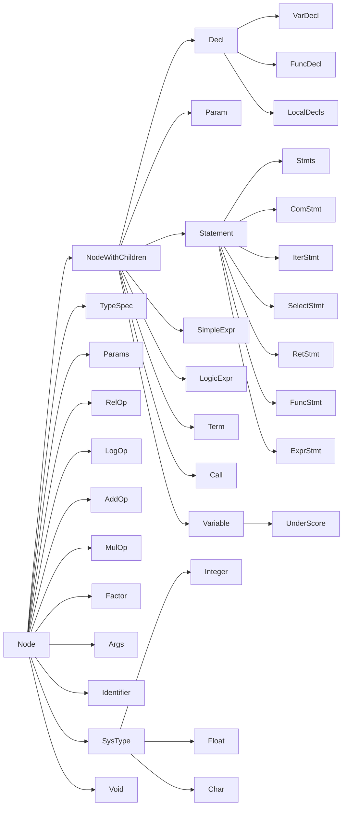

#### 抽象语法树生成

抽象语法树（abstract syntax code，AST）是源代码的抽象语法结构的树状表示，树上的每个节点都表示源代码中的一种结构，之所以说是抽象的，是因为抽象语法树并不会表示出真实语法出现的每一个细节，比如说，嵌套括号被隐含在树的结构中，并没有以节点的形式呈现。抽象语法树并不依赖于源语言的语法，也就是说语法分析阶段所采用的上下文无文文法，因为在写文法时，经常会对文法进行等价的转换（消除左递归，回溯，二义性等），这样会给文法分析引入一些多余的成分，对后续阶段造成不利影响，甚至会使合个阶段变得混乱。因些，很多编译器经常要独立地构造语法分析树，为前端，后端建立一个清晰的接口。
##### 基类
为了利于语法树的一致性，便于可视化，所有类型的节点都从基类`Node`继承而来。
```c++
class Node
{
private:
    std::string name;
protected:
    /* generate the json code of AST */
    std::string Format();
    template <typename base>
    std::string Format(base *child);
    template <typename base>
    std::string Format(std::vector<base *> *children);
    /* set the node name */
    void setName(std::string newName);

public:
    Node(std::string nodename) : name(nodename) {}
    /* visualize the node */
    virtual std::string Visualize() { return Format(); }
    /* generate the llvm::IR code*/
    virtual llvm::Value *Generate(CodeGenerator &codeGen) = 0;
    virtual ~Node() {}
};
```

成员`name`是语法树节点的名字，用于在可视化时标注节点名称。`Format`函数用于可视化语法树，基于孩子数目的不同，对`Format`函数进行了重载，分为无孩子、一个孩子和多个孩子三种情况，返回值为对应的`json`格式的字符串。

```c++
std::string Node::Format()
{
    return "{ \"name\" : \"" + this->name + "\" }";
}
template <typename base>
std::string Node::Format(base *child)
{
    return "{ \"name\" : \"" + this->name + "\", \"children\" : [ " + child->Visualize() + " ] }";
}
template <typename base>
std::string Node::Format(std::vector<base *> *children)
{
    std::string subtree = "{ \"name\" : \"" + this->name + "\", \"children\" : [ ";
    for (auto child : *children)
    {
        subtree += child->Visualize() + ", ";
    }
    if (children->size() != 0)
        subtree[subtree.size() - 2] = ' ';
    return subtree + "] }";
}
```

对于有多个孩子的节点，我们为其定义了一种新的类型`Node`，相当于在`Node`类的基础上增加了`NodeList`用于标记该节点的所有孩子。因为成员`children`只用于可视化，所以我们将所有孩子都cast到了基类`Node`上，来进行一致的可视化。

```c++
class NodeWithChildren : public Node
{
protected:
    NodeList *children; //cast all chillren to base class to visualize
public:
    NodeWithChildren(std::string name);
    std::string Visualize();
    virtual llvm::Value *Generate(CodeGenerator &codeGen) override;
    ~NodeWithChildren() { delete children; }
};
```

成员函数`Visualize`是对外定义的可视化函数，我们对每种特定的节点都进行了重写，于是在调用时只需在语法树根部节点调用`Visualize`函数即可递归生成语法树。`Generate`函数用于生成中间代码，我们将在第四部分详细介绍。

##### 语法树的节点类

在实际生成语法树时并不会使用前面定义的两个基本节点类型，而是使用了相应的`Terminal`和`Nontermianl`类型节点。

下图为我们定义的各种类型的节点的继承关系：



###### Nonterminal

| Class | Function |
| --- | --- |
| `Program` | 语法的开始符号，所有语法树的根节点 |
| `Decl` | 声明类型的节点 |
| `VarDecl` | 变量声明类型的节点 |
| `FuncDecl` | 函数声明类型的节点 |
| `TypeSpec` | 变量类型声明符 |
| `Param` | 函数定义中的单个参数定义 |
| `Params` | 函数定义中的所有参数定义或返回值定义 |
| `Statement` | 各种`Statement`类节点的基类 |
| `ComStmt` | 复合语句 |
| `ExprStmt` | 表达式或空语句 |
| `FuncStmt` | 函数调用的语句 |
| `SelectStmt` | If-else语句 |
| `IterStmt` | 循环语句 |
| `RetStmt` | 返回语句 |
| `Stmts` | 一个复合语句中所有`Statement`类语句的集合 |
| `SimpleExpr` | 二元比较语句或简单表达式 |
| `LocalDecls` | 一个复合语句中的所有局部声明 |
| `AddiExpr` | 含有加减法操作的表达式或简单表达式 |
| `LogicExpr` | 含有逻辑运算的表达式或简单表达式 |
| `RelOp` | 二元比较操作符 |
| `LogOp` | 逻辑操作符 |
| `AddOp` | 加法操作符 |
| `MulOp` | 乘除操作符 |
| `Term` | 含有乘除法操作的表达式或简单表达式 |
| `Factor` | 生成各种终结符或函数调用或递归的简单表达式 |
| `Call` | 函数调用语句 |
| `Variable` | 代表变量的节点 |
| `Args` | 函数调用时代表所有参数 |

###### Terminal

| Class | Base class |
| --- | --- |
| `Identifier` | 标识符，可以是函数名或变量名 |
| `SysType` | 内置类型，包括`void`、`int`、`float`、'char'、`string`和`long`类型。 |
| `Integer` | 内置类型`int` |
| `Float` | 内置类型`float` |
| `Char` | 内置类型`char` |
| `String` | 内置类型`string` |
| `UnderScore` | 匿名类型，用于多值返回时存储返回值 |
| `Void` | 内置类型`void` |

