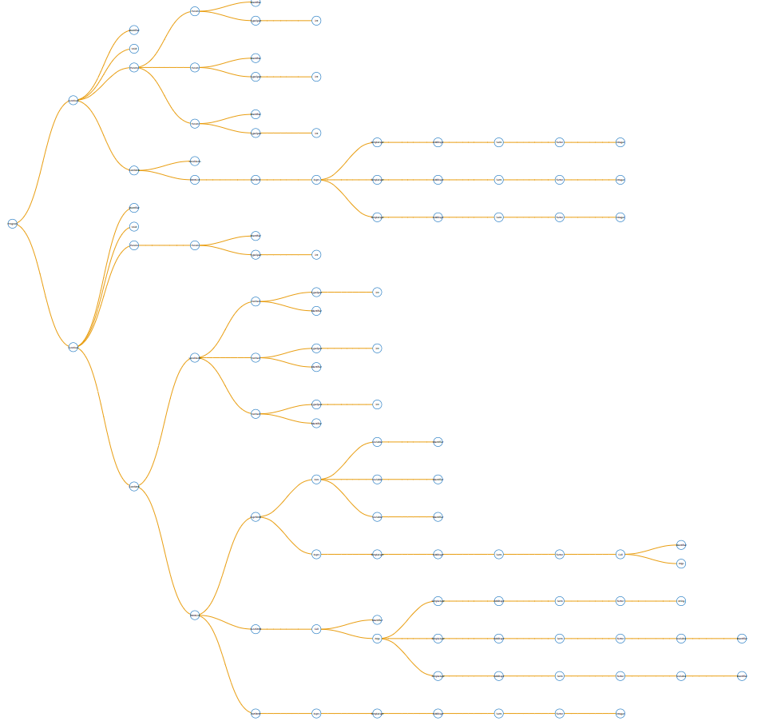
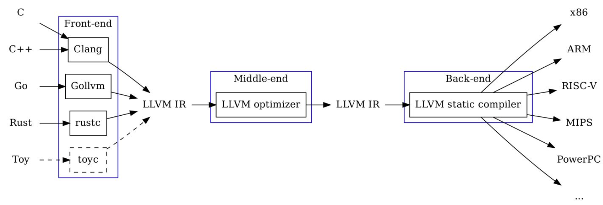

<div style="page-break-after: always;"></div>


[TOC]

<div style="page-break-after: always;"></div>

## 序言

### 1.1 概述

本次实验小组基于C++语言设计并实现了一个SPL语言的编译系统，该系统以符合SPL语言规范的代码文本文输入，输出为指定机器的目标代码。该SPL编译器的设计实现涵盖词法分析、语法分析、语义分析、优化考虑、代码生成等阶段和环节，所使用的具体技术包括但不限于：

- Flex实现词法分析
- Bison实现语法分析
- LLVM实现代码优化、中间代码生成、目标代码生成
- D3.JS实现AST可视化
- LLVM+Graphviz实现CFG可视化


### 1.2 开发环境

- 操作系统：Linux
- 编译环境：
  - Flex 2.6.4
  - Bison 3.5.1 (GNU Bison)
  - LLVM 9.0.0
- 编辑器：Visual Studio Code

### 1.3 文件说明

本次实验提交的文件及其说明如下：

- src：源代码文件夹

  - mini.l：Flex源代码，主要实现词法分析，生成Token
  - mini.y：Yacc源代码，主要实现语法分析，生成抽象语法树
  - ast.h：抽象语法树头文件，定义所有AST节点类
  - ast.cpp：抽象语法树实现文件，主要包含`codeGen`和`getJoson`方法的实现
  - CodeGenerator.h：中间代码生成器头文件，定义生成器环境
  - CodeGenerator.cpp：中间代码生成器实现文件
  - ObjGenerator.h：生成目标代码所用头文件
  - ppMacro.h：宏定义相关头文件
  - ppMacro.cpp：宏定义相关实现文件
  - Makefile：定义编译链接规则
  - gentest.sh：生成目标代码的脚本
  - tree.json：基于AST生成的JSON文件
  - tree.html：可视化AST的网页文件
  
- doc：报告文档文件夹

  - report.pdf：报告文档

  - Slides.pdf：展示文档

- test：测试用例文件夹

  - qsort
    - qsort.gc：快速排序的实现代码
    - linux-amd64：测试文件
  
  - matrix
    - matrix.gc：矩阵乘法的实现代码
    - linux-amd64：测试文件
  
  - course_assist
    - c_assist.gc：选课助手实现代码
    - linux-amd64：测试文件

### 1.4 组员分工

| 组员   | 具体分工                             |
| :----- | :----------------------------------- |
| 刘馨宇 | 词法分析，语法分析                   |
| 毕邹彬 | AST定义，AST可视化                   |
| 吴韬   | 语义分析，中间代码生成，目标代码生成 |


## 第二章 词法分析

词法分析是计算机科学中将字符序列转换为标记（token）序列的过程。在词法分析阶段，编译器读入源程序字符串流，将字符流转换为标记序列，同时将所需要的信息存储，然后将结果交给语法分析器。

### 2.1 Lex

CsGo编译器的词法分析使用Lex（Flex）完成，Lex是一个产生词法分析器的程序，是大多数UNIX系统的词法分析器产生程序。 Lex读入lex文件中定义的词法分析规则，输出C语言词法分析器源码。 标准lex文件由三部分组成，分别是定义区、规则区和用户子过程区。在定义区，用户可以编写C语言中的声明语句，导入需要的头文件或声明变量。在规则区，用户需要编写以正则表达式和对应的动作的形式的代码。在用户子过程区，用户可以定义函数。

### 2.2 正则表达式

正则表达式是通过单个字符串描述，匹配一系列符合某个句法规则的字符串。在实际应用中，常用到的语法规则如下：

|   字符   |                             描述                             |
| :------: | :----------------------------------------------------------: |
|   `\`    | 将下一个字符标记为一个特殊字符（File Format Escape，清单见本表）、或一个原义字符（Identity Escape，有^$()*+?.[\{\|共计12个)、或一个向后引用（backreferences）、或一个八进制转义符。例如，“`n`”匹配字符“`n`”。“`\n`”匹配一个换行符。序列“`\\`”匹配“`\`”而“`\(`”则匹配“`(`”。 |
|   `^`    | 匹配输入字符串的开始位置。如果设置了RegExp对象的Multiline属性，^也匹配“`\n`”或“`\r`”之后的位置。 |
|   `$`    | 匹配输入字符串的结束位置。如果设置了RegExp对象的Multiline属性，$也匹配“`\n`”或“`\r`”之前的位置。 |
|   `*`    | 匹配前面的子表达式零次或多次。例如，zo*能匹配“`z`”、“`zo`”以及“`zoo`”。*等价于{0,}。 |
|   `+`    | 匹配前面的子表达式一次或多次。例如，“`zo+`”能匹配“`zo`”以及“`zoo`”，但不能匹配“`z`”。+等价于{1,}。 |
|   `?`    | 匹配前面的子表达式零次或一次。例如，“`do(es)?`”可以匹配“`does`”中的“`do`”和“`does`”。?等价于{0,1}。 |
|  `{n}`   | *n*是一个非负整数。匹配确定的*n*次。例如，“`o{2}`”不能匹配“`Bob`”中的“`o`”，但是能匹配“`food`”中的两个o。 |
|  `{n,}`  | *n*是一个非负整数。至少匹配*n*次。例如，“`o{2,}`”不能匹配“`Bob`”中的“`o`”，但能匹配“`foooood`”中的所有o。“`o{1,}`”等价于“`o+`”。“`o{0,}`”则等价于“`o*`”。 |
| `{n,m}`  | *m*和*n*均为非负整数，其中*n*<=*m*。最少匹配*n*次且最多匹配*m*次。例如，“`o{1,3}`”将匹配“`fooooood`”中的前三个o。“`o{0,1}`”等价于“`o?`”。请注意在逗号和两个数之间不能有空格。 |
|   `?`    | 非贪心量化（Non-greedy quantifiers）：当该字符紧跟在任何一个其他重复修饰符（*,+,?，{*n*}，{*n*,}，{*n*,*m*}）后面时，匹配模式是**非**贪婪的。非贪婪模式尽可能少的匹配所搜索的字符串，而默认的贪婪模式则尽可能多的匹配所搜索的字符串。例如，对于字符串“`oooo`”，“`o+?`”将匹配单个“`o`”，而“`o+`”将匹配所有“`o`”。 |
|   `.`    | 匹配除“`\r`”“`\n`”之外的任何单个字符。要匹配包括“`\r`”“`\n`”在内的任何字符，请使用像“`(.|\r|\n)`”的模式。 |
|  `x|y`   | 没有包围在()里，其范围是整个正则表达式。例如，“`z|food`”能匹配“`z`”或“`food`”。“`(?:z|f)ood`”则匹配“`zood`”或“`food`”。 |
| `[xyz]`  | 字符集合（character class）。匹配所包含的任意一个字符。例如，“`[abc]`”可以匹配“`plain`”中的“`a`”。特殊字符仅有反斜线\保持特殊含义，用于转义字符。其它特殊字符如星号、加号、各种括号等均作为普通字符。脱字符^如果出现在首位则表示负值字符集合；如果出现在字符串中间就仅作为普通字符。连字符 - 如果出现在字符串中间表示字符范围描述；如果如果出现在首位（或末尾）则仅作为普通字符。右方括号应转义出现，也可以作为首位字符出现。 |
| `[^xyz]` | 排除型字符集合（negated character classes）。匹配未列出的任意字符。例如，“`[^abc]`”可以匹配“`plain`”中的“`plin`”。 |
| `[a-z]`  | 字符范围。匹配指定范围内的任意字符。例如，“`[a-z]`”可以匹配“`a`”到“`z`”范围内的任意小写字母字符。 |
| `[^a-z]` | 排除型的字符范围。匹配任何不在指定范围内的任意字符。例如，“`[^a-z]`”可以匹配任何不在“`a`”到“`z`”范围内的任意字符。 |
|   `\d`   | 匹配一个数字字符。等价于[0-9]。注意Unicode正则表达式会匹配全角数字字符。 |
|   `\D`   |              匹配一个非数字字符。等价于[^0-9]。              |
|   `\n`   |              匹配一个换行符。等价于\x0a和\cJ。               |
|   `\r`   |              匹配一个回车符。等价于\x0d和\cM。               |
|   `\s`   | 匹配任何空白字符，包括空格、制表符、换页符等等。等价于[ \f\n\r\t\v]。注意Unicode正则表达式会匹配全角空格符。 |
|   `\S`   |          匹配任何非空白字符。等价于[^ \f\n\r\t\v]。          |
|   `\w`   | 匹配包括下划线的任何单词字符。等价于“`[A-Za-z0-9_]`”。注意Unicode正则表达式会匹配中文字符。 |
|   `\W`   |        匹配任何非单词字符。等价于“`[^A-Za-z0-9_]`”。         |

### 2.3 具体实现

#### 2.3.1 定义区

CsGo在定义区导入了需要的头文件，如`<stdio.h>`, `<string>`, `<sstream>`等。同时，引入了两个函数`clean_string`和`clean_char`。`clean_string`的作用是去除字符串两侧的`"`，同时处理字符串中的转义字符，使其从单纯的字符串变为真正的转义字符（如，将"\n"变为换行）。`clean_char`的作用是去除字符两侧的`'`，同时将字符串状态的转义字符变为真正的转义字符。

```c
#include <stdio.h>
#include <string>
#include <cstring>
#include <sstream>
#include "ast.h"
#include "parser.hpp"
extern "C" int yywrap() {return 1;}
int clean_string () {
    char* mystr;
    mystr = strdup(yytext+1) ; // copy yytext and remove leading "
    if (!mystr) return 1;
    mystr[yyleng-2] = '\0';    // remove trailing "
    for (int i = 0, j = 0; i <= strlen(mystr); i++, j++) { // "<=" and not "<" to get /0, i : mystr indice and j : yytext indice
        if (mystr[i] == '\\') {
            i++;
            if (mystr[i] == 'n')        yytext[j]='\n';
            else if (mystr[i] == 'r')   yytext[j]='\r';
            else if (mystr[i] == 't')   yytext[j]='\t';
            else if (mystr[i] == '0')   yytext[j]='\0';
            else yytext[j] = mystr[i];
        }
        else yytext[j] = mystr[i];
    }
    yyleng=strlen(yytext);
    free(mystr);
    return 0 ;
}

int clean_char () {
    printf("yytext is %s\n", yytext);
    char* mystr;
    mystr = strdup(yytext) ; // copy yytext
    if (!mystr) return 1;
    // mystr[yyleng-2] = '\0';    // remove trailing "
    for (int i = 0, j = 0; i <= strlen(mystr); i++, j++) { // "<=" and not "<" to get /0, i : mystr indice and j : yytext indice
        if (mystr[i] == '\\') {
            i++;
            if (mystr[i] == 'n')        yytext[j]='\n';
            else if (mystr[i] == 'r')   yytext[j]='\r';
            else if (mystr[i] == 't')   yytext[j]='\t';
            else if (mystr[i] == '0')   i--;
            else yytext[j] = mystr[i];
        }
        else yytext[j] = mystr[i];
    }
    yyleng=3;
    free(mystr);
    printf("yytext is %s\n", yytext);
    return 0 ;
}
```

#### 2.3.2 规则区

首先，排除空格、换行和回车的干扰，将它们解析成：

```c
[ \t\n]                                                 { ; }
```

之后，解析关键字、运算符和界符。

```C、
[ \t\n]                             { ; }
"("                                 {return LP; }
")"                                 {return RP; }
"["                                 {return LB; }
"]"                                 {return RB; }
"{"                                 {return LCP; }
"}"                                 {return RCP; }
"."                                 {return DOT; }
","                                 {return COMMA; }
":"                                 {return COLON; }
"_"                                 {return UNDERSCORE; }
"*"                                 {return MUL; }
"/"                                 {return DIV; }
"+"                                 {return PLUS; }
"-"                                 {return MINUS; }
"%"                                 {return MOD; }
"!="                                {return UNEQUAL; }
"=="                                {return EQUAL; }
">="                                {return GE; }
"<="                                {return LE; }
">"                                 {return GT; }
"<"                                 {return LT; }
"="                                 {return ASSIGN; }
";"                                 {return SEMI; }
"&&"                                {return AND; }
"||"                                {return OR; }
"!"                                 {return NOT; }
"if"                                {return IF; }
"else"                              {return ELSE; }
"while"                             {return WHILE; }
"func"                              {return FUNC; }
"return"                            {return RETURN; }
"void"                              {
                                        yylval.sVal = new std::string(yytext, yyleng);
                                        return VOID; 
                                    }
"int"|"float"|"char"|"string"       {
                                        yylval.sVal = new std::string(yytext, yyleng);
                                        return SYS_TYPE;
                                    }
```

标识符是以字母或下划线开头，由字母、下划线和数字组成的字符串。

```
[a-zA-Z_][a-zA-Z0-9_]*              { 
                                        yylval.sVal = new std::string(yytext, yyleng);
                                        return IDENTIFIER; 
                                    } 
```

整数类型`int`只支持正数。

```
(0|[1-9][0-9]*)                     {
                                        int itmp;
                                        sscanf(yytext, "%d", &itmp);
                                        yylval.iVal = itmp; 
                                        return INTEGER; 
                                    }
```

浮点数类型`float`支持科学计数法。

```
([0-9]+\.[0-9]*)([eE][-+]?[0-9]+)?  { 
                                        float ftmp;
                                        sscanf(yytext, "%f", &ftmp);
                                        yylval.fVal = ftmp;
                                        return FLOAT; 
                                    }
```

字符类型`char`和字符串类型`string`都支持转义字符:

```
\"(\\.|[^"])*\"                     {
                                        clean_string();
                                        yylval.sVal = new std::string(yytext, yyleng);
                                        return STRING;
                                    }

[\']([^\n\t]|[\\]n|[\\]t|[\\]0|[\\]r)[\'] {
                                        char ctmp;
                                        if (yyleng == 4) {
                                            clean_char();
                                        }
                                        if (strcmp(yytext, "\'\\0\'") == 0) {
                                            ctmp = '\0';
                                            printf("ctmp = 0!!!!!!!\n");
                                        }
                                        else {
                                            sscanf(yytext, "\'%c\'", &ctmp);
                                        }
                                        yylval.cVal = ctmp;
                                        return CHAR;
                                    }
```

## 第三章 语法分析

在计算机科学和语言学中，语法分析是根据某种给定的形式文法对由单词序列（如英语单词序列）构成的输入文本进行分析并确定其语法结构的一种过程。在词法分析阶段，编译器接收词法分析器发送的标记序列，最终输出抽象语法树数据结构。

### 3.1 Yacc

SPL编译器的语法分析使用Yacc（Bison）完成。Yacc是Unix/Linux上一个用来生成编译器的编译器（编译器代码生成器）。Yacc生成的编译器主要是用C语言写成的语法解析器（Parser），需要与词法解析器Lex一起使用，再把两部分产生出来的C程序一并编译。

与Lex相似，Yacc的输入文件由以%%分割的三部分组成，分别是声明区、规则区和程序区。三部分的功能与Lex相似，不同的是规则区的正则表达式替换为CFG，在声明区要提前声明好使用到的终结符以及非终结符的类型。

```c
  declarations
  %%
  rules
  %%
  programs
```

### 3.2 语法规则

CsGo的语法规则如下：

```
1. program -> declaration-list
2. declaration-list -> declaration-list declaration | declaration
3. declaration -> var-declaration | fun-declaration
4. var-declaration -> type-specifier ID; | type-specifier ID [NUM];
5. type-specifier -> int | float | void
6. fun-declaration -> func ID(params) (params) compound-stmt
7. params -> param-list | void
8. param-list -> param-list, param | param
9. param -> ID type-specifier | ID [] type-specifier 
10. compound-stmt -> {local-declarations statement-list}
11. local-declarations -> local-declarations var-declaration | empty
12. statement-list -> statement-list statement | empty
13. statement -> expression-stmt | compound-stmt | selection-stmt
                 | iteration-stmt | return-stmt | function-stmt
14. expression-stmt -> expression; | ;
15. selection-stmt -> if (simple-expression) statement
                      | if (simple-expression) statement else statement
16. iteration-stmt -> while (simple-expression) statement
17. return-stmt -> return expression; | return INTEGER; | return FLOAT;
18. function-stmt -> call;
19. expression -> var-list = expression-list
20. expression-list -> expression-list, simple-expression | simple-expression
21. var-list -> var-list, var | var | _	
22. var -> ID | ID [simple-expression]
23. simple-expression -> additive-expression relop additive_expr | additive_expr
24. relop -> <= | < | > | >= | == | !=
25. additive-expression -> additive-expression addop term | term
26. addop -> + | -
27. term -> term mulop factor | factor
28. mulop -> * | /
29. factor -> (simple-expression) | var | call | NUM
30. call -> ID (args)
31. args -> arg-list | empty
32. arg-list -> arg-list, simple-expression | simple-expression
```

### 3.3 具体实现

#### 3.3.1 声明区

在声明区引入相关的头文件，以及定义错误处理函数。

```C
#include "ppMacro.h"
#include "ast.h"
#include "CodeGenerator.h"
#include "ObjGenerator.h"
#include <string>
#include <stdio.h>
#include <iostream>
#include <fstream>

using namespace std;

void yyerror(const char *s) { 
    std::printf("Error: %s\n", s);
    std::exit(1); 
}

int yylex();
Program* root = nullptr;
```

#### 3.3.2 规则定义区

首先，定义非终结符对应的数据类型：

```C
%union {
    int iVal;
    float fVal;
    char cVal;
    std::string* sVal;
    Program *program;
    Identifier *identifier;
    SysType *systype;
    Integer *integer;
    Float *nfloat;
    Char *nchar;
    String *nstring;
    UnderScore *underscore;
    Void *nvoid;
    Decl *decl;
    VarDecl *vardecl;
    FuncDecl *funcdecl;
    TypeSpec *typespec;
    Param *param;
    Params *params;
    ComStmt *comstmt;
    ExprStmt *exprstmt;
    FuncStmt *funcstmt;
    SelectStmt *selectstmt;
    IterStmt *iterstmt;
    RetStmt *retstmt;
    Statement *statement;
    SimpleExpr *simpleexpr;
    LogicExpr *logicexpr;
    LocalDecls *localdecls;
    Stmts *stmts;
    AddiExpr *addiexpr;
    RelOp *relop;
    AddOp *addop;
    MulOp *mulop;
    LogOp *logop;
    Term *term;
    Factor *factor;
    Call *call;
    Variable *variable;
    Args *args;

    DeclList *decllist;
    LocalList *locallist;
    ParamList *paramlist;
    StmtList *stmtlist;
    ExprList *exprlist;
    VarList *varlist;
    ArgList *arglist;
}

%token<iVal> INTEGER
%token<sVal> IDENTIFIER SYS_TYPE VOID STRING
%token<fVal> FLOAT
%token<cVal> CHAR

%type<program>                          program
%type<decllist>                         decl_list
%type<decl>                             decl
%type<vardecl>                          var_decl
%type<funcdecl>                         fun_decl
%type<typespec>                         type_specifier
%type<params>                           params
%type<param>                            param
%type<comstmt>                          compound_stmt
%type<paramlist>                        param_list
%type<locallist>                        local_decls
%type<stmtlist>                         stmt_list
%type<statement>                        stmt 
%type<exprstmt>                         expr_stmt
%type<funcstmt>                         function_stmt
%type<selectstmt>                       selection_stmt
%type<iterstmt>                         iteration_stmt
%type<retstmt>                          return_stmt
%type<exprstmt>                         expr 
%type<varlist>                          var_list
%type<logicexpr>                        logic_expr
%type<simpleexpr>                       simple_expr
%type<variable>                         var
%type<addiexpr>                         additive_expr
%type<term>                             term
%type<factor>                           factor
%type<args>                             args
%type<arglist>                          arg_list
%type<exprlist>                         expr_list
%type<relop>                            relop
%type<addop>                            addop
%type<mulop>                            mulop
%type<logop>                            logop
%type<call>                             call
```

定义规则中的非终结符：

```C
%token  LP RP LB RB LCP RCP
        DOT COMMA COLON UNDERSCORE
        MUL DIV PLUS MINUS MOD
        GE GT LE LT EQUAL UNEQUAL
        ASSIGN
        SEMI
        AND OR NOT
        IF ELSE WHILE FOR
        FUNC RETURN
```

为了防止出现dangling else问题，定义语法规则的优先级：

```C
%nonassoc LOWER_THAN_ELSE
%nonassoc ELSE
```

之后，按照上述的语法规则，构建语法树。

#### 3.3.3 程序区

~~~C
在程序区，首先解析输入参数，若没有发现待编译的文件，则打印提示信息。若参数正常，则解析文件内容，构建语法树，将语法树送入后端进行最终代码生成。

int main(int argc, char** argv) {
    extern int yyparse(void);
	extern FILE* yyin;
    if (argc == 1) {
        printf("Please provide the file's name\n");
    } 
    else if (argc == 2) {
        if ((yyin = fopen(preProcess(std::string(argv[1])).c_str(), "r")) == NULL){
	        printf("Can't open file %s\n", argv[1]);
	        return 1;
	    }
        if (yyparse()) {
            fprintf(stderr, "Error\n");
            exit(1);
        }
    } 
    else {
        printf("Wrong parameters\n");
    }

    if(root != nullptr){
        std::ofstream os("ast.json");
        os << root->Visualize() << std::endl;
    }

    llvm::InitializeNativeTarget();
    llvm::InitializeNativeTargetAsmPrinter();
    llvm::InitializeNativeTargetAsmParser();
    CodeGenerator generator;
    generator.generateCode(*root);
    ObjGen(generator);

    return 0;
}
~~~

## 第四章 抽象语法树

抽象语法树（abstract syntax code，AST）是源代码的抽象语法结构的树状表示，树上的每个节点都表示源代码中的一种结构，之所以说是抽象的，是因为抽象语法树并不会表示出真实语法出现的每一个细节，比如说，嵌套括号被隐含在树的结构中，并没有以节点的形式呈现。抽象语法树并不依赖于源语言的语法，也就是说语法分析阶段所采用的上下文无文文法，因为在写文法时，经常会对文法进行等价的转换（消除左递归，回溯，二义性等），这样会给文法分析引入一些多余的成分，对后续阶段造成不利影响，甚至会使合个阶段变得混乱。因些，很多编译器经常要独立地构造语法分析树，为前端，后端建立一个清晰的接口。

### 4.1 基类

为了利于语法树的一致性，便于可视化，所有类型的节点都从基类`Node`继承而来。

```C
class Node
{
private:
    std::string name;
protected:
    /* generate the json code of AST */
    std::string Format();
    template <typename base>
    std::string Format(base *child);
    template <typename base>
    std::string Format(std::vector<base *> *children);
    /* set the node name */
    void setName(std::string newName);

public:
    Node(std::string nodename) : name(nodename) {}
    /* visualize the node */
    virtual std::string Visualize() { return Format(); }
    /* generate the llvm::IR code*/
    virtual llvm::Value *Generate(CodeGenerator &codeGen) = 0;
    virtual ~Node() {}
};
```

成员`name`是语法树节点的名字，用于在可视化时标注节点名称。`Format`函数用于可视化语法树，基于孩子数目的不同，对`Format`函数进行了重载，分为无孩子、一个孩子和多个孩子三种情况，返回值为对应的`json`格式的字符串。

```C
std::string Node::Format()
{
    return "{ \"name\" : \"" + this->name + "\" }";
}
template <typename base>
std::string Node::Format(base *child)
{
    return "{ \"name\" : \"" + this->name + "\", \"children\" : [ " + child->Visualize() + " ] }";
}
template <typename base>
std::string Node::Format(std::vector<base *> *children)
{
    std::string subtree = "{ \"name\" : \"" + this->name + "\", \"children\" : [ ";
    for (auto child : *children)
    {
        subtree += child->Visualize() + ", ";
    }
    if (children->size() != 0)
        subtree[subtree.size() - 2] = ' ';
    return subtree + "] }";
}
```

对于有多个孩子的节点，我们为其定义了一种新的类型`Node`，相当于在`Node`类的基础上增加了`NodeList`用于标记该节点的所有孩子。因为成员`children`只用于可视化，所以我们将所有孩子都cast到了基类`Node`上，来进行一致的可视化。

```C
class NodeWithChildren : public Node
{
protected:
    NodeList *children; //cast all chillren to base class to visualize
public:
    NodeWithChildren(std::string name);
    std::string Visualize();
    virtual llvm::Value *Generate(CodeGenerator &codeGen) override;
    ~NodeWithChildren() { delete children; }
};
```

成员函数`Visualize`是对外定义的可视化函数，我们对每种特定的节点都进行了重写，于是在调用时只需在语法树根部节点调用`Visualize`函数即可递归生成语法树。`Generate`函数用于生成中间代码，我们将在第四部分详细介绍。

### 4.2 语法树结点类

在实际生成语法树时并不会使用前面定义的两个基本节点类型，而是使用了相应的`Terminal`和`Nontermianl`类型节点。

下图为我们定义的各种类型的节点的继承关系：


##### Nonterminal

| Class        | Function                                   |
| ------------ | ------------------------------------------ |
| `Program`    | 语法的开始符号，所有语法树的根节点         |
| `Decl`       | 声明类型的节点                             |
| `VarDecl`    | 变量声明类型的节点                         |
| `FuncDecl`   | 函数声明类型的节点                         |
| `TypeSpec`   | 变量类型声明符                             |
| `Param`      | 函数定义中的单个参数定义                   |
| `Params`     | 函数定义中的所有参数定义或返回值定义       |
| `Statement`  | 各种`Statement`类节点的基类                |
| `ComStmt`    | 复合语句                                   |
| `ExprStmt`   | 表达式或空语句                             |
| `FuncStmt`   | 函数调用的语句                             |
| `SelectStmt` | If-else语句                                |
| `IterStmt`   | 循环语句                                   |
| `RetStmt`    | 返回语句                                   |
| `Stmts`      | 一个复合语句中所有`Statement`类语句的集合  |
| `SimpleExpr` | 二元比较语句或简单表达式                   |
| `LocalDecls` | 一个复合语句中的所有局部声明               |
| `AddiExpr`   | 含有加减法操作的表达式或简单表达式         |
| `LogicExpr`  | 含有逻辑运算的表达式或简单表达式           |
| `RelOp`      | 二元比较操作符                             |
| `LogOp`      | 逻辑操作符                                 |
| `AddOp`      | 加法操作符                                 |
| `MulOp`      | 乘除操作符                                 |
| `Term`       | 含有乘除法操作的表达式或简单表达式         |
| `Factor`     | 生成各种终结符或函数调用或递归的简单表达式 |
| `Call`       | 函数调用语句                               |
| `Variable`   | 代表变量的节点                             |
| `Args`       | 函数调用时代表所有参数                     |

##### Terminal

| Class        | Base class                                                   |
| ------------ | ------------------------------------------------------------ |
| `Identifier` | 标识符，可以是函数名或变量名                                 |
| `SysType`    | 内置类型，包括`void`、`int`、`float`、'char'、`string`和`long`类型。 |
| `Integer`    | 内置类型`int`                                                |
| `Float`      | 内置类型`float`                                              |
| `Char`       | 内置类型`char`                                               |
| `String`     | 内置类型`string`                                             |
| `UnderScore` | 匿名类型，用于多值返回时存储返回值                           |
| `Void`       | 内置类型`void`                                               |

### 4.3 抽象语法树可视化 

语法树可视化使用d3.js完成，d3.js可以通过Json数据绘制出树图html，AST可以通过根节点(Program)的getJson方法获得Json数据。

语法树可视化工作流如下：

1. 生成AST
2. 调用getJson方法
3. 在ast.html下构建一个服务器，推荐使用VSCode的liveServer，注意要把ast.html和ast.json放在同一路径下
4. 打开浏览器，输入服务器地址，即可看到树图。

JSON数据获取函数：

```C++
string getJsonString(string name) {
    return "{ \"name\" : \"" + name + "\" }";
}

string getJsonString(string name, vector<string> children) {
    string result = "{ \"name\" : \"" + name + "\", \"children\" : [ ";
    int i = 0;
    for(auto &child : children) {
        if(i != children.size() - 1)
            result += child + ", ";
        else 
            result += child + " ";
        i++;
    }
    return result + " ] }";
}

string getJsonString(string name, string value) {
    return getJsonString(name, vector<string>{value});
}

string getJsonString(string name, string value, vector<string> children) {
    string result = "{ \"name\" : \"" + name + "\", \"value\" : \"" + value + "\", \"children\" : [ ";
    int i = 0;
    for(auto &child : children) {
        if(i != children.size() - 1)
            result += child + ", ";
        else 
            result += child + " ";
        i++;
    }
    return result + " ] }";
}
```

具体效果如下：



## 第五章 语义分析

### 5.1 LLVM概述

LLVM(Low Level Virtual Machine)是以C++编写的编译器基础设施，包含一系列模块化的编译器组件和工具教练用俩开发编译器前端和后端。LLVM起源于2000年伊利诺伊大学Vikram Adve和Chris Lattner的研究，它是为了任意一种编程语言而写成的程序，利用虚拟技术创造出编译阶段、链接阶段、运行阶段以及闲置阶段的优化，目前支持Ada、D语言、Fortran、GLSL、Java字节码、Swift、Python、Ruby等十多种语言。

- 前端：LLVM最初被用来取代现有于GCC堆栈的代码产生器，许多GCC的前端已经可以与其运行，其中Clang是一个新的编译器，同时支持C、Objective-C以及C++。
- 中间端：LLVM IR是一种类似汇编的底层语言，一种强类型的精简指令集，并对目标指令集进行了抽象。LLVM支持C++中对象形式、序列化bitcode形式和汇编形式。
- 后端：LLVM支持ARM、Qualcomm Hexagon、MPIS、Nvidia并行指令集等多种后端指令集。

### 5.2 LLVM IR

LLVM IR是LLVM的核心所在，通过将不同高级语言的前端变换成LLVM IR进行优化、链接后再传给不同目标的后端转换成为二进制代码，前端、优化、后端三个阶段互相解耦，这种模块化的设计使得LLVM优化不依赖于任何源码和目标机器。



#### 5.2.1 IR布局

每个IR文件称为一个Module，它是其他所有IR对象的顶级容器，包含了目标信息、全局符号和所依赖的其他模块和符号表等对象的列表，其中全局符号又包括了全局变量、函数声明和函数定义。

函数由参数和多个基本块组成，其中第一个基本块称为entry基本块，这是函数开始执行的起点，另外LLVM的函数拥有独立的符号表，可以对标识符进行查询和搜索。

每一个基本块包含了标签和各种指令的集合，标签作为指令的索引用于实现指令间的跳转，指令包含Phi指令、一般指令以及终止指令等。


#### 5.2.2 IR上下文环境

- LLVM::Context：提供用户创建变量等对象的上下文环境，尤其在多线程环境下至关重要
- LLVM::IRBuilder：提供创建LLVM指令并将其插入基础块的API

#### 5.2.3 IR核心类


- llvm::Value表示一个类型的值，具有一个llvm::Type*成员和一个use list，前者指向值的类型类，后者跟踪使用了该值的其他对象，可以通过迭代器进行访问。

  - 值的存取分别可以通过llvm::LoadInst和llvm::StoreInst实现，也可以借助IRBuilder的CreateLoad和CreateStore实现。
- llvm::Type表示类型类，LLVM支持17种数据类型，可以通过Type ID判断类型：

```C++
 enum TypeID {
    // PrimitiveTypes - make sure LastPrimitiveTyID stays up to date.
    VoidTyID = 0,    ///<  0: type with no size
    HalfTyID,        ///<  1: 16-bit floating point type
    FloatTyID,       ///<  2: 32-bit floating point type
    DoubleTyID,      ///<  3: 64-bit floating point type
    X86_FP80TyID,    ///<  4: 80-bit floating point type (X87)
    FP128TyID,       ///<  5: 128-bit floating point type (112-bit mantissa)
    PPC_FP128TyID,   ///<  6: 128-bit floating point type (two 64-bits, PowerPC)
    LabelTyID,       ///<  7: Labels
    MetadataTyID,    ///<  8: Metadata
    X86_MMXTyID,     ///<  9: MMX vectors (64 bits, X86 specific)
    TokenTyID,       ///< 10: Tokens

    // Derived types... see DerivedTypes.h file.
    // Make sure FirstDerivedTyID stays up to date!
    IntegerTyID,     ///< 11: Arbitrary bit width integers
    FunctionTyID,    ///< 12: Functions
    StructTyID,      ///< 13: Structures
    ArrayTyID,       ///< 14: Arrays
    PointerTyID,     ///< 15: Pointers
    VectorTyID       ///< 16: SIMD 'packed' format, or other vector type
  };
```

- llvm::Constant表示各种常量的基类，包括ConstantInt整形常量、ConstantFP浮点型常量、ConstantArray数组常量、ConstantStruct结构体常量等。

### 5.3 IR生成

#### 5.3.1 运行环境设计

LLVM IR的生成依赖上下文环境，我们构造了CodeGenerator类来保存环境，在递归遍历AST节点的时候传递CodeGenerator的实例进行每个节点的IR生成。CodeGenerator包括的环境配置：

- 静态全局的上下文变量和构造器变量

```C++
LLVMContext llvmContext;
llvm::IRBuilder<> builder;
```

- 公有的模块实例、系统函数、函数栈
  - 模块实例是中间代码顶级容器，用于包含所有变量、函数和指令
  - 系统函数为`printf`和`scanf`，用于从标准输出和标准输入
  - 函数栈用于存储所有函数的返回值类型。由于函数可以返回多值，所以本语言实现过程中函数返回均以结构体形式返回（void返回、系统函数、main函数返回值除外）。用函数栈存储返回值类型有助于快速构造出对应的结构体类型。

```C++
std::unique_ptr<Module> theModule;
Function *printf, *scanf;
std::map<std::string, Type*> funcStack; 
```

- 符号表：由Block类的堆栈组成，而Block类对应语言中的一个代码块，存储llvm基础块、局部变量值以及类型。此处局部变量的值均存储指针的值，即`llvm::CreateAlloca`分配的空间地址；如果本身是指针则存储指针本身。

~~~C++
class Block{
public:
    BasicBlock * block;
    std::map<std::string, Value*> localVar;
    std::map<std::string, Type*> types;

    Block(BasicBlock* _block): block(_block){}
};
~~~

此外还需要一些类方法来快速修改运行环境：

- 创建和删除基本块
- 获取、设置变量的值以及类型：下面是获取变量值的方法。在基本块的堆栈中自顶向下寻找对应的变量名，符合语言中同变量名的就近原则。获取变量类型同理。在设置变量值或类型时，只需要在当前块（即栈顶）设置即可

```C++
    // Get the pointer of a variable
    Value* getSymValue(std::string name){
        // Search from the top of the stack
        // So if there are variables of the same name, we will get the closest one 
        for(auto current=blockStack.rbegin(); current!=blockStack.rend(); current++){
            if((*current)->localVar.find(name) != (*current)->localVar.end()){
                return (*current)->localVar[name];
            }
        }
        return nullptr;
    }

    // Store the pointer of a variable in the current block
    void setSymValue(std::string name, Value* value){
        blockStack.back()->localVar[name] = value;
    }
```

- 增加函数、获取函数返回值
- 创建系统函数：创建过程与一般函数类似。首先需要定义输入参数类型：第一个参数为8位int指针（字符串）以及可变数量的后续参数。定义返回类型：32位int。创建对应的函数类型和实例。

~~~C++
    // Create printf
    void createPrintf()
    {
        // Input type, the first argument must be a string
        std::vector<Type*> arg_types;
        arg_types.push_back(builder.getInt8PtrTy());
        // Return type is int32, "true" means alterable number of arguments
        auto printf_type = FunctionType::get(builder.getInt32Ty(), llvm::makeArrayRef(arg_types), true);
        auto func = Function::Create(printf_type, Function::ExternalLinkage, llvm::Twine("printf"), theModule.get());
        func->setCallingConv(llvm::CallingConv::C);
        printf = func;
    }
    
    // Create scanf
    void createScanf()
    {
        // Input type, the first argument must be a string
        std::vector<Type*> arg_types;
        arg_types.push_back(builder.getInt8PtrTy());
        // Return type is int32, "true" means alterable number of arguments
        auto scanf_type = FunctionType::get(builder.getInt32Ty(), llvm::makeArrayRef(arg_types), true);
        auto func = Function::Create(scanf_type, Function::ExternalLinkage, llvm::Twine("scanf"), theModule.get());
        func->setCallingConv(llvm::CallingConv::C);
        scanf = func;
    }
~~~

#### 5.3.2 类型系统

系统定义了语言中的类型（CG_INTEGER等），此处需要把语法类型转换成llvm类型，定义了两个函数，分别获取对应的llvm值类型和指针类型：

```C++
    // Transform from CsGo types to llvm types
    Type* getLLVMType(BuildInType type){
        switch(type){
            case CG_INTEGER : return Type::getInt32Ty(llvmContext);
            case CG_FLOAT : return Type::getDoubleTy(llvmContext);
            case CG_CHAR : return Type::getInt8Ty(llvmContext);
            case CG_STRING : return Type::getInt8PtrTy(llvmContext);
            case CG_VOID : return Type::getVoidTy(llvmContext);
            case CG_LONG : return Type::getInt64Ty(llvmContext);
        }
    }

    // Get llvm pointer type of CsGo type
    Type* getLLVMPtrType(BuildInType type){
        switch(type){
            case CG_INTEGER : return Type::getInt32PtrTy(llvmContext);
            case CG_FLOAT : return Type::getDoublePtrTy(llvmContext);
            case CG_CHAR : return Type::getInt8PtrTy(llvmContext);
            case CG_STRING : return PointerType::getUnqual(Type::getInt8PtrTy(llvmContext));
        }
    }
```

#### 5.3.3 常量获取

可以通过IRBuilder快速获取`llvm::Constant`值。string统一用全局字符串的方式存储。

```C++
// Generate int type
Value* Integer::Generate(CodeGenerator &codeGen){
    return codeGen.builder.getInt32(this->value);
}

// Generate float type, we use double here
Value* Float::Generate(CodeGenerator &codeGen){
    return llvm::ConstantFP::get(codeGen.builder.getDoubleTy(), this->value);
}

// Generate string type, we use global string here
// This is different from string variable, variable needs to be a pointer
// String in the code can be store in global data area
Value* String::Generate(CodeGenerator &codeGen){
    return codeGen.builder.CreateGlobalStringPtr(this->value);
}

// Generate char type, int8
Value* Char::Generate(CodeGenerator &codeGen){
    return codeGen.builder.getInt8(this->value);
}
```

#### 5.3.4 变量定义

变量区分一般变量和数组变量两种情况：

- 一般变量：得到llvm类型后直接使用`llvm::CreateAlloca`分配空间即可
- 数组变量：首先根据元素类型和元素个数获得对应的llvm的array类型，然后分配相应的arraytype空间

分配空间后在运行环境中设置对应的变量值（地址）和类型。

```C++
// Generate IR code for variable declaration
Value* VarDecl::Generate(CodeGenerator &codeGen){
    // Get type
    BuildInType inType = this->typeSpec->getType();
    Type* type = codeGen.getLLVMType(inType);
    Value* inst = nullptr;
    // If it's array, create arraytype
    if(this->isArray){
        llvm::ArrayType* arrayType = llvm::ArrayType::get(type, (uint64_t)(this->integer->getValue()));
        inst = codeGen.builder.CreateAlloca(arrayType);
        codeGen.setSymType(this->identifier->getID(), arrayType);
    }else{
        inst = codeGen.builder.CreateAlloca(type);
        codeGen.setSymType(this->identifier->getID(), type);
    }
    codeGen.setSymValue(this->identifier->getID(), inst);
    return inst;
}
```

#### 5.3.5 变量取值

考虑到在语言中变量取值的目的不同（如赋值表达式右边的变量需要取值，而左边的变量需要取地址），这里的变量取值统一返回地址，而后续其他类可以根据需要选择直接使用地址或者取值。对于一般变量，直接在符号表中获取即可（因为符号表中存储的就是变量地址）。而对于数组类型则比较复杂：

- 首先需要判断是否给定下标。如果没有给定（如函数参数传递中的`a[]`），则下标为0；否则为给定的下标。将第一个下标（0）和当前下标push到一个vector中，便于后面获取指针的函数使用。

```C++
std::vector<Value*> indices;
indices.push_back(llvm::ConstantInt::get(codeGen.getLLVMType(CG_INTEGER), 0, false));
Value* index;
// Otherwise index is need
if(!this->isPointer()){
   index = this->simpleExpr->Generate(codeGen);
   indices.push_back(index)
}else{
   indices.push_back(llvm::ConstantInt::get(codeGen.getLLVMType(CG_INTEGER), 0, false));
}
```

- 然后需要判断数组的类型。因为如果是在该数组定义的块中，由“变量定义”一节可以看到类型是`llvm::ArrayType`；但在其他块中，如在另一个函数里传递了数组变量，按照本语言函数参数的传参方法，传递的是地址首指针。对于这两种类型需要采取不同的方法获取元素地址。
  - 如果是arraytype，直接调用IRBuilder的`CreateInBoundsGEP`方法即可，需要传递arraytype的变量指针（可从符号表获得）和index的vector。
  - 如果是指针（首地址），则需要进行指针运算。如果没有指定index，则直接返回首地址即可；否则将地址转化为64位int（`CreatePtrToInt`），再与offset相加，再将相加后的64位int转化为指针（`CreateIntToPtr`）。此处需要注意：`offset=index*size`，而不同元素的size是不同的，所以这里需要获取指针所指向元素的类型（`getPointerElementType()`），再根据类型设置对应的size。此外，本系统中的int常量是用32位int存储的，而指针转化后的int是64位，需要将32位int转化为64位int（`CreateZExt`）才能进行运算。

```C++
 if(type->isArrayTy()){
            // Get pointer with index
            auto ptr = codeGen.builder.CreateInBoundsGEP(inst, indices);
            return ptr;
        }else{
            // If there is no index, just return the first pointer
            if(this->isPointer()) return inst;
            // Otherwise we need to get the pointer from the first pointer and offset
            // Get elementtype to calculate offset
            auto elementType = inst->getType()->getPointerElementType();
            int length;
            BuildInType ptrtype;
            // Get size
            if(elementType->isIntegerTy(32)){
                length = 4;
                ptrtype = CG_INTEGER;
            }else if(elementType->isIntegerTy(8)){
                length = 1;
                ptrtype = CG_CHAR;
            }else if(elementType->isDoubleTy()){
                length = 8;
                ptrtype = CG_FLOAT;
            }else if(elementType->isPointerTy()){
                length = 8;
                ptrtype = CG_STRING;
            }
            // Traverse pointer to int, and add the offset, traverse int to pointer
            Value* begin = codeGen.builder.CreatePtrToInt(inst, codeGen.getLLVMType(CG_LONG));
            Value* offset = codeGen.builder.CreateZExt(index, codeGen.getLLVMType(CG_LONG));
            Value* realoffset = codeGen.builder.CreateMul(offset, codeGen.builder.getInt64(length));
            Value* add = codeGen.builder.CreateAdd(begin, realoffset);
            auto ptr = codeGen.builder.CreateIntToPtr(add, codeGen.getLLVMPtrType(ptrtype));
            return ptr;
```

#### 5.3.6 操作数取值

操作数是语法中定义的Factor类，是运算表达式、赋值表达式等语句中的操作数。操作数可以是常量、变量、函数调用或一个表达式。

- 对于除变量以外的形式，直接调用对应类的Generate方法即可；
- 对于变量类型，由“变量取值”一节可以看到，变量取值返回的是地址，而操作数取值需要判断：如果是指针类型，则直接传递指针；否则需要将返回的地址的存储的值取出（`CreateLoad`）。

```C++
// Generate IR code for Factor
Value* Factor::Generate(CodeGenerator &codeGen){
    switch(this->factorType){
        case FT_SIMPLEEXPR: return this->simpleExpr->Generate(codeGen);
        // If this is a pointer type, return a pointer; otherwise load and return the value 
        case FT_VAR: if(this->variable->isPointer()) return this->variable->Generate(codeGen);
                     else return codeGen.builder.CreateLoad(this->variable->Generate(codeGen));
        case FT_CALL: return this->call->Generate(codeGen);
        case FT_FLOAT: return this->nfloat->Generate(codeGen);
        case FT_INTEGER: return this->integer->Generate(codeGen);
        case FT_CHAR: return this->nchar->Generate(codeGen);
        case FT_STRING: return this->nstring->Generate(codeGen);
    }
}
```

#### 5.3.7 二元运算表达式

二元运算表达式是指由规则`term->term mulop factor | factor `，`additive_expr->additive_expr addop term | term`，`simple_expr->additive_expr relop additive_expr | additive_expr`，`logic_expr->logic_expr logop simple_expr | simple_expr`所建立的表达式。由于这些规则中涉及到的非终结符及ast节点类的功能十分相似，对应代码生成的过程也十分相似，故一起说明。基本流程为：

- 判断是否有运算符：如果有则调用两个操作数的Generate；否则只有一个操作数，调用该操作数的Generate并直接返回
- 如果有两个操作数，根据操作符创建相应的运算指令。部分运算指令（如加减乘除）需要考虑整型与浮点的不同情况。

下面的代码以term类为例：

```C++
// Generate IR code for Term
Value* Term::Generate(CodeGenerator &codeGen){
    // Generate IR code for factors
    Value* right = this->factor->Generate(codeGen);
    // If there is only a factor, just return the value
    if(this->mulOp==nullptr) return right;
    Value* left = this->term->Generate(codeGen);
    
    //todo : type check
    bool isFloat = left->getType()->isDoubleTy() || right->getType()->isDoubleTy();
    if(!left || !right){
        return nullptr;
    }
    // Create IR instructions corresponding to operation type
    switch(this->mulOp->getOpType()){
        case MT_MUL: return isFloat ? codeGen.builder.CreateFMul(left, right, "multmpf") : codeGen.builder.CreateMul(left, right, "multmpi");
        case MT_DIV: return isFloat ? codeGen.builder.CreateFDiv(left, right, "divmpf") : codeGen.builder.CreateSDiv(left, right, "divmpi");
        case MT_MOD: return nullptr; //todo: mod
    }
    //todo:error
}
```

在处理加减运算的时候，需要注意一种特殊情况：指针运算（本语言中只支持指针的加减运算，如`a[] + i`）。此处的特殊处理与“变量取值”一节中的指针处理类似：`a[]`会返回头指针，`i`为整型，需要经过指针转整型、判断元素类型获取size、32位int转64位int、整型加减、整型转指针的流程。具体代码与“变量取值”一节相同，这里不再展示。

#### 3.3.9 赋值语句

本语言支持多值赋值，中间代码生成只要将对应位置进行赋值即可。需要注意的地方有：

- 赋值表达式左边是变量类，变量取值返回的是指针，所以赋值的时候直接`CreateStore`即可。
- 不能逐个做取值赋值，否则交叉赋值（如`a, b = b, a`）会有bug。需要将所有的值全部取出后再一一赋值。
- 对于函数调用的情况：函数返回的多值是存储在结构体里的，所以函数调用类的Generate返回结构体。此处需要将结构体的元素一一取出（`CreateExtractValue`），而返回结构体的类型信息会在函数定义的类中存储到全局的函数栈中。
- 赋值中遇到`_`直接跳过。

```C++
// Generate assign statements
Value* ExprStmt::Generate(CodeGenerator &codeGen){
    // Get var list and expr list
    VarList var = *(this->vars->getVarlist());
    ExprList expr = *(this->exprs->getExprlist());
    //todo: error(different terms)
    std::vector<Value*> tmp;
    // Traverse
    for(auto &thisExpr : expr){
        auto right = thisExpr->Generate(codeGen);
        std::string funcname = thisExpr->getCallName();
        if(funcname!="" && funcname != "printf" && funcname != "scanf"){
            // Get number of struct elements and traverse
            int num = codeGen.getReturnType(funcname)->getStructNumElements();
            for(int i=0;i<num;i++){
                // Extract value and assign to a variable
                Value* structValue = codeGen.builder.CreateExtractValue(right, (uint64_t)i);
                tmp.push_back(structValue);
            }
        }else{
            // Assign directly
            tmp.push_back(right);
        }
    }
    auto thisValue = tmp.begin();
    for(auto &thisVar : var){
        std::string name = thisVar->getID();
        if(name=="") {
            thisValue++;
            continue;
        }
        codeGen.builder.CreateStore(*thisValue, thisVar->Generate(codeGen));
        thisValue++;
    }
    return nullptr;
}
```

#### 3.3.10 函数定义

函数定义包括以下流程：

- 参数类型：需要判断是否为数组。如果是数组则对应参数类型是指针；否则是对应的llvm类型。

```C++
    if(!this->inParams->getVoid()){
        ParamList inParamList = *(this->inParams->getParamList());
        // Arraytype must be stored as pointer
        for(auto &param: inParamList){
            if(param->getIsArray()){
                argType.push_back(codeGen.getLLVMPtrType(param->getType()));
            }else{
                argType.push_back(codeGen.getLLVMType(param->getType()));
            }
        }
    } 
```

- 返回值类型：判断是否需要返回结构体。返回void、系统函数、main函数这三种情况不需要返回结构体，其他统一用结构体封装。结构体成员类型可以用`setBody`函数封装，需要将所有成员的类型push到vector中。

```C++
	if(this->outParams->getVoid()){
        type = codeGen.getLLVMType(CG_VOID);    
    }else if(this->identifier->getID()=="main"){
        //todo:error
        type = retType.at(0);
    }
    else{
        // Set a struct type
        auto structType = StructType::create(codeGen.llvmContext, "retType");
        structType->setBody(retType);
        type = structType;
    }
```

- 定义函数原型和实例，并修改运行环境：创建一个新的block，设置代码插入点，将返回值添加到函数栈中。

```c++
    // Create function
    functionType = FunctionType::get(type, argType, false);
    function = Function::Create(functionType, llvm::GlobalValue::ExternalLinkage, this->identifier->getID(), codeGen.theModule.get());
    BasicBlock* basicBlock = BasicBlock::Create(codeGen.llvmContext, "entry", function, nullptr);
    
    // Add function and push block
    codeGen.builder.SetInsertPoint(basicBlock);
    codeGen.pushBlock(basicBlock);
    codeGen.addFunc(funcName, type);
```

- 为传入参数分配空间并赋值。传入参数的值可以通过`function->args()`方法得到。此处逻辑与变量定义、变量取值一致。不过需要注意的是，由于符号表中存储的是变量的地址，所以设置符号表时，对于一般变量需要存储`CreateAlloca`返回的值；但对于指针类型，不能存储指针的地址而是指针本身，所以需要对`CreateAlloca`的地址进行`CreateLoad`操作后再存入符号表中。

```C++
    // Create stores for input parameter
    if(!this->inParams->getVoid()){
        ParamList inParamList = *(this->inParams->getParamList());
        auto thisParam = inParamList.begin();
        auto thisValue = function->args().begin();
        // Traverse input parameters
        for(;thisParam!=inParamList.end();thisParam++, thisValue++){
            thisValue->setName((*thisParam)->getName());
            Value* alloc = (*thisParam)->Generate(codeGen);
            // Store the value in local variables
            codeGen.builder.CreateStore(thisValue, alloc, false);
            // If it's pointer, just store it's value
            // Otherwise store it's pointer
            if((*thisParam)->getIsArray()){
                codeGen.setSymValue((*thisParam)->getName(), codeGen.builder.CreateLoad(alloc));
            }
            else codeGen.setSymValue((*thisParam)->getName(), alloc);
        }
    }
```

- 生成函数体的中间代码，直接调用对应类的Generate即可。生成完毕后修改运行环境，删除当前block。

```c++
    this->comStmt->Generate(codeGen);
    codeGen.popBlock();
```

#### 3.3.11 返回语句

返回语句的逻辑如下：

- 首先需要获取所在函数的返回值信息，`getParent`用于获取当前所在的函数。如果返回的是void，直接创建ret void的语句并返回。

```C++
    Function* function = codeGen.builder.GetInsertBlock()->getParent();
    Type* retType = function->getReturnType();
    // If it's void, just create a void return instruction
    if(retType->isVoidTy()) return codeGen.builder.CreateRetVoid();
```

- 如果返回struct，则需要一一设置结构体成员的值，设置方法为：`CreateInBoundGEP`获取每个成员的指针，`CreateStore`赋值。

```C++
    if(retType->isStructTy()){
        // Get all member types
        for(auto thisExpr=expr.begin(); thisExpr!=expr.end(); thisExpr++){
            Value* thisValue = (*thisExpr)->Generate(codeGen);
            std::vector<Value*> indices;
            indices.push_back(llvm::ConstantInt::get(codeGen.getLLVMType(CG_INTEGER), 0, false));
            indices.push_back(llvm::ConstantInt::get(codeGen.getLLVMType(CG_INTEGER), (uint64_t)distance(expr.begin(),thisExpr), false));
            // Get the pointer and store the value
            auto ptr = codeGen.builder.CreateInBoundsGEP(inst, indices);
            codeGen.builder.CreateStore(thisValue, ptr);
        }    
    }
```

- 如果返回单值，则直接`CreateStore`即可。

```C++
else{
        // Just store the value, for main, scanf, printf
        codeGen.builder.CreateStore(expr.at(0)->Generate(codeGen), inst);
    }
```

- 创建返回值语句并返回。

```C++
    Value* returnValue = codeGen.builder.CreateLoad(inst);
    codeGen.builder.CreateRet(returnValue);
```

#### 3.3.12 函数调用

函数调用需要注意的一点是：语言中没有显式支持指针，所以对于scanf函数的处理与一般函数不同：scanf的参数需要传递指针。下面是函数调用的处理逻辑：

- 首先根据函数名获取函数实例，需要对系统函数和用户定义函数区分：系统函数直接获取；用户定义函数可以通过`getFunction`获取。同时对是否为scanf做标记。

```C++
    if(name=="printf"){
        function = codeGen.printf;
        isScanf = false;
    }else if(name=="scanf"){
        function = codeGen.scanf;
        isScanf = true;
    }else{
        function = codeGen.theModule->getFunction(this->identifier->getID());
        isScanf = false;
    }
```

- 设置参数：将所有参数的值push到一个vector中。scanf函数需要存指针的值。这里需要注意的是scanf第一个参数是string，这个参数本身就是以全局字符串的方式存储，不需要取地址。对于其他参数，需要取出指针。arg类返回值，这里获取指针的策略是通过arg类获取对应的var类（即”变量取值“小节对应的类），该类返回指针。

```C++
    if(this->args->getArgList()!=nullptr){
        // Get argument list and traverse
        ArgList argsn = *(this->args->getArgList());
        for(auto &thisArg : argsn){
            Value* value;
            bool isString;
            Variable* var = thisArg->getVariable(isString);
            // If this is scanf function and not the first string, We need to transfer pointer types
            // Otherwise we need to transfer the value
            if(isScanf && !isString){
                //todo:error
                value = var->Generate(codeGen);
            }else{ 
                value = thisArg->Generate(codeGen);
            }
            argsv.push_back(value);
            // If any argument codeGen fail, return null
            if( !argsv.back() ){
                return nullptr;
            }
        }
    }
```

- 创建call语句并获得返回值。

```c++
    Value *res = codeGen.builder.CreateCall(function, argsv);
```

#### 3.3.13 if语句

if语句被抽象成四个基础块：原有块（计算cond值）、if块（cond为真）、else块（cond为假）、end块（if语句结束后的后续语句块）。此处分为有else和没有else两种情况，两种情况对应的DAG图为：


需要注意的点为：

- BasicBlock构造过程中可以指定插入的函数，如果没有指定，则需要push到BasicBlockList中。
- 每一个新块插入代码前需要设置insertpoint，同时设置运行环境。
- 检测每一个块是否已有终结语句。如在if块中已经有return语句，则不需要创建从if到end的无条件跳转。else同理。

```C++
// Generate IR code for if statement
Value* SelectStmt::Generate(CodeGenerator &codeGen){
    // Get condition value
    Value* condValue = this->logicExpr->Generate(codeGen);
    if( !condValue )
        return nullptr;
    // Get function where if statement is in
    Function* theFunction = codeGen.builder.GetInsertBlock()->getParent();

    // Create 3 bodies: if, else, and end(after if or else it will jump tp end)
    BasicBlock *ifbody = BasicBlock::Create(codeGen.llvmContext, "ifbody", theFunction);
    BasicBlock *elsebody = BasicBlock::Create(codeGen.llvmContext, "elsebody");
    BasicBlock *end = BasicBlock::Create(codeGen.llvmContext, "end");

    // whether there is else
    if( this->isIfelse ){
        codeGen.builder.CreateCondBr(condValue, ifbody, elsebody);
    } else{
        codeGen.builder.CreateCondBr(condValue, ifbody, end);
    }

    codeGen.builder.SetInsertPoint(ifbody);

    // Generate IR code for if body
    codeGen.pushBlock(ifbody);
    this->ifStmt->Generate(codeGen);
    codeGen.popBlock();

    // If there is return in if body, it will not jump to end block 
    ifbody = codeGen.builder.GetInsertBlock();
    if( ifbody->getTerminator() == nullptr ){   
        // Create jump to end block 
        codeGen.builder.CreateBr(end);
    }

    // If there has a else, create else block
    if( this->isIfelse ){
        theFunction->getBasicBlockList().push_back(elsebody);    
        codeGen.builder.SetInsertPoint(elsebody);            

        // Generate IR code for else body
        codeGen.pushBlock(elsebody);
        this->elStmt->Generate(codeGen);
        codeGen.popBlock();

        // If there is return in else body, it will not jump to end block
        elsebody = codeGen.builder.GetInsertBlock();
        if(elsebody->getTerminator() == nullptr){
            // Create jump to end block
            codeGen.builder.CreateBr(end);
        }
    }

    // Create end block
    theFunction->getBasicBlockList().push_back(end);        
    codeGen.builder.SetInsertPoint(end);        

    return nullptr;
}
```

#### 3.3.14 while语句

while语句被抽象成三个基础块：cond块（计算cond值，需要反复计算）、body块（循环体）、end块（while语句结束后的后续语句块）。对应的DAG图为：


注意点和生成流程与if类似。

```C++
// Generate IR code for while statement
Value* IterStmt::Generate(CodeGenerator &codeGen){
    // Get the function where while statement is in
    Function* theFunction = codeGen.builder.GetInsertBlock()->getParent();

    // Create blocks for cond value, iter body and end
    BasicBlock *cond = BasicBlock::Create(codeGen.llvmContext, "cond", theFunction);
    BasicBlock *body = BasicBlock::Create(codeGen.llvmContext, "body");
    BasicBlock *end = BasicBlock::Create(codeGen.llvmContext, "end");

    // Former code jump to cond
    codeGen.builder.CreateBr(cond);
    codeGen.builder.SetInsertPoint(cond);
    
    // Generate cond value
    Value* condValue = this->logicExpr->Generate(codeGen);
    if( !condValue )
        return nullptr;

    // Create cond jump
    codeGen.builder.CreateCondBr(condValue, body, end);

    theFunction->getBasicBlockList().push_back(body);
    codeGen.builder.SetInsertPoint(body);

    // Create IR code for iter body
    codeGen.pushBlock(body);
    this->statement->Generate(codeGen);
    codeGen.popBlock();

    // If there is return in iter body, it will not jump to end
    body = codeGen.builder.GetInsertBlock();
    if(body->getTerminator() == nullptr){
        codeGen.builder.CreateBr(cond);
    }

    // Create end
    theFunction->getBasicBlockList().push_back(end);
    codeGen.builder.SetInsertPoint(end);

    return nullptr;
}
```

## 第六章 代码生成

### 5.1 选择目标机器

LLVM 支持本地交叉编译。我们可以将代码编译为当前计算机的体系结构，也可以像针对其他体系结构一样轻松地进行编译。LLVM 提供了 `sys::getDefaultTargetTriple`，它返回当前计算机的目标三元组：

```c++
auto targetTriple = llvm::sys::getDefaultTargetTriple();
codeGen.theModule->setTargetTriple(targetTriple);
```

在获取Target前，初始化所有目标以发出目标代码：

```c++
InitializeAllTargetInfos();
InitializeAllTargets();
InitializeAllTargetMCs();
InitializeAllAsmParsers();
InitializeAllAsmPrinters();
```

使用目标三元组获得 Target：

```c++
std::string Error;
auto Target = TargetRegistry::lookupTarget(TargetTriple, Error);

// Print an error and exit if we couldn't find the requested target.
// This generally occurs if we've forgotten to initialise the
// TargetRegistry or we have a bogus target triple.
if (!Target) {
  errs() << Error;
  return 1;
}
```

 `TargetMachine` 类提供了我们要定位的机器的完整机器描述：

```c++
auto CPU = "generic";
auto Features = "";

TargetOptions opt;
auto RM = Optional<Reloc::Model>();
auto TargetMachine = Target->createTargetMachine(TargetTriple, CPU, Features, opt, RM);
```

### 6.2 配置 Module

配置模块，以指定目标和数据布局，可以方便了解目标和数据布局。

```c++
codeGen.theModule->setDataLayout(theTargetMachine->createDataLayout());
```

### 6.3 生成目标代码

1. 先定义要将文件写入的位置

```c++
auto Filename = "output.o";
std::error_code EC;
raw_fd_ostream dest(Filename, EC, sys::fs::OF_None);

if (EC) {
  errs() << "Could not open file: " << EC.message();
  return 1;
}
```

2. 定义一个发出目标代码的过程，然后运行该 pass

```c++
legacy::PassManager pass;
auto FileType = TargetMachine::CGFT_ObjectFile;

if (TargetMachine->addPassesToEmitFile(pass, dest, nullptr, FileType)) {
  errs() << "TargetMachine can't emit a file of this type";
  return 1;
}

pass.run(*generator.TheModule);
dest.flush();
```

## 第七章 测试案例

### 6.1 快速排序测试

- 测试代码

```pascal
#define INC(x) x=x+1
#define DEC(x) x=x-1
func qsort(arr[] int, begin int, end int)(void){
    if(begin<end){
        int i;
        int j;
        int key;
        i, j, key = begin, end, arr[begin];
        while(i<j){
            while(i<j && arr[j]>key){
                DEC(j);
            }
            if(i<j){
                arr[i]=arr[j];
                INC(i);
            }
            while(i<j && arr[i]<key){
                INC(i);
            }
            if(i<j){
                arr[j]=arr[i];
                DEC(j);
            }
        }
        arr[i]=key;
        qsort(arr[], begin, i-1);
        qsort(arr[], i+1, end);
    }
    return;
}

func main(void)(ret int){
    int arr[10000];
    int len;
    int i;
    scanf("%d",len);
    i=0;
    while(i<len){
        scanf("%d",arr[i]);
        INC(i);
    }
    qsort(arr[], 0, len-1);
    i=0;
    while(i<len){
        printf("%d\n",arr[i]);
        INC(i);
    }
    return 0;
}
```

- AST

  

- IR

```asm
; ModuleID = 'main'
source_filename = "main"

@0 = private unnamed_addr constant [3 x i8] c"%d\00", align 1
@1 = private unnamed_addr constant [3 x i8] c"%d\00", align 1
@2 = private unnamed_addr constant [4 x i8] c"%d\0A\00", align 1

declare i32 @printf(i8*, ...)

declare i32 @scanf(i8*, ...)

define void @qsort(i32* %arr, i32 %begin, i32 %end) {
entry:
  %0 = alloca i32*
  store i32* %arr, i32** %0
  %1 = load i32*, i32** %0
  %2 = alloca i32
  store i32 %begin, i32* %2
  %3 = alloca i32
  store i32 %end, i32* %3
  %4 = load i32, i32* %2
  %5 = load i32, i32* %3
  %tmpSLT = icmp slt i32 %4, %5
  br i1 %tmpSLT, label %ifbody, label %end23

ifbody:                                           ; preds = %entry
  %6 = alloca i32
  %7 = alloca i32
  %8 = alloca i32
  %9 = load i32, i32* %2
  %10 = load i32, i32* %3
  %11 = load i32, i32* %2
  %12 = ptrtoint i32* %1 to i64
  %13 = zext i32 %11 to i64
  %14 = mul i64 %13, 4
  %15 = add i64 %12, %14
  %16 = inttoptr i64 %15 to i32*
  %17 = load i32, i32* %16
  store i32 %9, i32* %6
  store i32 %10, i32* %7
  store i32 %17, i32* %8
  br label %cond

cond:                                             ; preds = %end19, %ifbody
  %18 = load i32, i32* %6
  %19 = load i32, i32* %7
  %tmpSLT1 = icmp slt i32 %18, %19
  br i1 %tmpSLT1, label %body, label %end20

body:                                             ; preds = %cond
  br label %cond2

cond2:                                            ; preds = %body4, %body
  %20 = load i32, i32* %7
  %21 = ptrtoint i32* %1 to i64
  %22 = zext i32 %20 to i64
  %23 = mul i64 %22, 4
  %24 = add i64 %21, %23
  %25 = inttoptr i64 %24 to i32*
  %26 = load i32, i32* %25
  %27 = load i32, i32* %8
  %tmpSGT = icmp sgt i32 %26, %27
  %28 = load i32, i32* %6
  %29 = load i32, i32* %7
  %tmpSLT3 = icmp slt i32 %28, %29
  %andtmp = and i1 %tmpSLT3, %tmpSGT
  br i1 %andtmp, label %body4, label %end5

body4:                                            ; preds = %cond2
  %30 = load i32, i32* %7
  %subtmpi = sub i32 %30, 1
  store i32 %subtmpi, i32* %7
  br label %cond2

end5:                                             ; preds = %cond2
  %31 = load i32, i32* %6
  %32 = load i32, i32* %7
  %tmpSLT6 = icmp slt i32 %31, %32
  br i1 %tmpSLT6, label %ifbody7, label %end8

ifbody7:                                          ; preds = %end5
  %33 = load i32, i32* %7
  %34 = ptrtoint i32* %1 to i64
  %35 = zext i32 %33 to i64
  %36 = mul i64 %35, 4
  %37 = add i64 %34, %36
  %38 = inttoptr i64 %37 to i32*
  %39 = load i32, i32* %38
  %40 = load i32, i32* %6
  %41 = ptrtoint i32* %1 to i64
  %42 = zext i32 %40 to i64
  %43 = mul i64 %42, 4
  %44 = add i64 %41, %43
  %45 = inttoptr i64 %44 to i32*
  store i32 %39, i32* %45
  %46 = load i32, i32* %6
  %addtmpi = add i32 %46, 1
  store i32 %addtmpi, i32* %6
  br label %end8

end8:                                             ; preds = %ifbody7, %end5
  br label %cond9

cond9:                                            ; preds = %body13, %end8
  %47 = load i32, i32* %6
  %48 = ptrtoint i32* %1 to i64
  %49 = zext i32 %47 to i64
  %50 = mul i64 %49, 4
  %51 = add i64 %48, %50
  %52 = inttoptr i64 %51 to i32*
  %53 = load i32, i32* %52
  %54 = load i32, i32* %8
  %tmpSLT10 = icmp slt i32 %53, %54
  %55 = load i32, i32* %6
  %56 = load i32, i32* %7
  %tmpSLT11 = icmp slt i32 %55, %56
  %andtmp12 = and i1 %tmpSLT11, %tmpSLT10
  br i1 %andtmp12, label %body13, label %end15

body13:                                           ; preds = %cond9
  %57 = load i32, i32* %6
  %addtmpi14 = add i32 %57, 1
  store i32 %addtmpi14, i32* %6
  br label %cond9

end15:                                            ; preds = %cond9
  %58 = load i32, i32* %6
  %59 = load i32, i32* %7
  %tmpSLT16 = icmp slt i32 %58, %59
  br i1 %tmpSLT16, label %ifbody17, label %end19

ifbody17:                                         ; preds = %end15
  %60 = load i32, i32* %6
  %61 = ptrtoint i32* %1 to i64
  %62 = zext i32 %60 to i64
  %63 = mul i64 %62, 4
  %64 = add i64 %61, %63
  %65 = inttoptr i64 %64 to i32*
  %66 = load i32, i32* %65
  %67 = load i32, i32* %7
  %68 = ptrtoint i32* %1 to i64
  %69 = zext i32 %67 to i64
  %70 = mul i64 %69, 4
  %71 = add i64 %68, %70
  %72 = inttoptr i64 %71 to i32*
  store i32 %66, i32* %72
  %73 = load i32, i32* %7
  %subtmpi18 = sub i32 %73, 1
  store i32 %subtmpi18, i32* %7
  br label %end19

end19:                                            ; preds = %ifbody17, %end15
  br label %cond

end20:                                            ; preds = %cond
  %74 = load i32, i32* %8
  %75 = load i32, i32* %6
  %76 = ptrtoint i32* %1 to i64
  %77 = zext i32 %75 to i64
  %78 = mul i64 %77, 4
  %79 = add i64 %76, %78
  %80 = inttoptr i64 %79 to i32*
  store i32 %74, i32* %80
  %81 = load i32, i32* %2
  %82 = load i32, i32* %6
  %subtmpi21 = sub i32 %82, 1
  call void @qsort(i32* %1, i32 %81, i32 %subtmpi21)
  %83 = load i32, i32* %6
  %addtmpi22 = add i32 %83, 1
  %84 = load i32, i32* %3
  call void @qsort(i32* %1, i32 %addtmpi22, i32 %84)
  br label %end23

end23:                                            ; preds = %end20, %entry
  ret void
}

define i32 @main() {
entry:
  %0 = alloca [10000 x i32]
  %1 = alloca i32
  %2 = alloca i32
  %3 = call i32 (i8*, ...) @scanf(i8* getelementptr inbounds ([3 x i8], [3 x i8]* @0, i32 0, i32 0), i32* %1)
  store i32 0, i32* %2
  br label %cond

cond:                                             ; preds = %body, %entry
  %4 = load i32, i32* %2
  %5 = load i32, i32* %1
  %tmpSLT = icmp slt i32 %4, %5
  br i1 %tmpSLT, label %body, label %end

body:                                             ; preds = %cond
  %6 = load i32, i32* %2
  %7 = getelementptr inbounds [10000 x i32], [10000 x i32]* %0, i32 0, i32 %6
  %8 = call i32 (i8*, ...) @scanf(i8* getelementptr inbounds ([3 x i8], [3 x i8]* @1, i32 0, i32 0), i32* %7)
  %9 = load i32, i32* %2
  %addtmpi = add i32 %9, 1
  store i32 %addtmpi, i32* %2
  br label %cond

end:                                              ; preds = %cond
  %10 = getelementptr inbounds [10000 x i32], [10000 x i32]* %0, i32 0, i32 0
  %11 = load i32, i32* %1
  %subtmpi = sub i32 %11, 1
  call void @qsort(i32* %10, i32 0, i32 %subtmpi)
  store i32 0, i32* %2
  br label %cond1

cond1:                                            ; preds = %body3, %end
  %12 = load i32, i32* %2
  %13 = load i32, i32* %1
  %tmpSLT2 = icmp slt i32 %12, %13
  br i1 %tmpSLT2, label %body3, label %end5

body3:                                            ; preds = %cond1
  %14 = load i32, i32* %2
  %15 = getelementptr inbounds [10000 x i32], [10000 x i32]* %0, i32 0, i32 %14
  %16 = load i32, i32* %15
  %17 = call i32 (i8*, ...) @printf(i8* getelementptr inbounds ([4 x i8], [4 x i8]* @2, i32 0, i32 0), i32 %16)
  %18 = load i32, i32* %2
  %addtmpi4 = add i32 %18, 1
  store i32 %addtmpi4, i32* %2
  br label %cond1

end5:                                             ; preds = %cond1
  %19 = alloca i32
  store i32 0, i32* %19
  %20 = load i32, i32* %19
  ret i32 %20
}
```

- 运行结果


### 6.2 矩阵乘法测试

- 测试代码

```pascal
#define index(i,j,N) i*N+j
func ReadOrPrint(M int, N int, A[] int, flag int)(void)
{
    int i;
    int j;
    i = 0;
    while(i<M)
    {
        j = 0;
        while(j<N)
        {
            if(flag==0)
            {
                scanf("%d", A[index(i,j,N)]);
            }
            else
            {
                printf("%10d", A[index(i,j,N)]);
            }
            j = j + 1;
        }
        i = i + 1;
        if(flag!=0)
        {
            printf("\n");
        }
    }
    return;
}

func CalElement(M1 int, N1 int, A1[] int, N2 int, A2[] int, i int, j int)(ret int)
{
    int x;
    int sum_element;
    int sum;

    x, sum = 0, 0;

    while(x<N1)
    {
        sum_element = A1[index(i,x,N1)] * A2[index(x,j,N2)];
        sum = sum + sum_element;
        x = x + 1;
    }
    return sum;
}

func Cal(M1 int, N1 int, A1[] int, M2 int, N2 int, A2[] int, R[] int)(void)
{
    int i;
    int j;
    i = 0;
    if(N1!=M2)
    {
        printf("Incompatible Dimensions\n");
        return;
    }
    while(i<M1)
    {
        j = 0;
        while(j<N2)
        {
            R[index(i,j,N2)] = CalElement(M1, N1, A1[], N2, A2[], i, j);
            j = j + 1;
        }
        i = i + 1;
    }
    ReadOrPrint(M1, N2, R[], 1);
    return;
}

func main(void)(ret int)
{
    int N1;
    int M1;
    int N2;
    int M2;
    int A1[400];
    int A2[400];
    int R[400];

    scanf("%d %d", M1, N1);
    ReadOrPrint(M1, N1, A1[], 0);
    scanf("%d %d", M2, N2);
    ReadOrPrint(M2, N2, A2[], 0);

    Cal(M1, N1, A1[], M2, N2, A2[], R[]);
    
    return 0;
}
```

- AST


- IR

```asm
; ModuleID = 'main'
source_filename = "main"

%retType = type { i32 }

@0 = private unnamed_addr constant [3 x i8] c"%d\00", align 1
@1 = private unnamed_addr constant [5 x i8] c"%10d\00", align 1
@2 = private unnamed_addr constant [2 x i8] c"\0A\00", align 1
@3 = private unnamed_addr constant [25 x i8] c"Incompatible Dimensions\0A\00", align 1
@4 = private unnamed_addr constant [6 x i8] c"%d %d\00", align 1
@5 = private unnamed_addr constant [6 x i8] c"%d %d\00", align 1

declare i32 @printf(i8*, ...)

declare i32 @scanf(i8*, ...)

define void @ReadOrPrint(i32 %M, i32 %N, i32* %A, i32 %flag) {
entry:
  %0 = alloca i32
  store i32 %M, i32* %0
  %1 = alloca i32
  store i32 %N, i32* %1
  %2 = alloca i32*
  store i32* %A, i32** %2
  %3 = load i32*, i32** %2
  %4 = alloca i32
  store i32 %flag, i32* %4
  %5 = alloca i32
  %6 = alloca i32
  store i32 0, i32* %5
  br label %cond

cond:                                             ; preds = %end10, %entry
  %7 = load i32, i32* %5
  %8 = load i32, i32* %0
  %tmpSLT = icmp slt i32 %7, %8
  br i1 %tmpSLT, label %body, label %end11

body:                                             ; preds = %cond
  store i32 0, i32* %6
  br label %cond1

cond1:                                            ; preds = %end, %body
  %9 = load i32, i32* %6
  %10 = load i32, i32* %1
  %tmpSLT2 = icmp slt i32 %9, %10
  br i1 %tmpSLT2, label %body3, label %end7

body3:                                            ; preds = %cond1
  %11 = load i32, i32* %4
  %tmpEQ = icmp eq i32 %11, 0
  br i1 %tmpEQ, label %ifbody, label %elsebody

ifbody:                                           ; preds = %body3
  %12 = load i32, i32* %6
  %13 = load i32, i32* %1
  %14 = load i32, i32* %5
  %multmpi = mul i32 %14, %13
  %addtmpi = add i32 %multmpi, %12
  %15 = ptrtoint i32* %3 to i64
  %16 = zext i32 %addtmpi to i64
  %17 = mul i64 %16, 4
  %18 = add i64 %15, %17
  %19 = inttoptr i64 %18 to i32*
  %20 = call i32 (i8*, ...) @scanf(i8* getelementptr inbounds ([3 x i8], [3 x i8]* @0, i32 0, i32 0), i32* %19)
  br label %end

elsebody:                                         ; preds = %body3
  %21 = load i32, i32* %6
  %22 = load i32, i32* %1
  %23 = load i32, i32* %5
  %multmpi4 = mul i32 %23, %22
  %addtmpi5 = add i32 %multmpi4, %21
  %24 = ptrtoint i32* %3 to i64
  %25 = zext i32 %addtmpi5 to i64
  %26 = mul i64 %25, 4
  %27 = add i64 %24, %26
  %28 = inttoptr i64 %27 to i32*
  %29 = load i32, i32* %28
  %30 = call i32 (i8*, ...) @printf(i8* getelementptr inbounds ([5 x i8], [5 x i8]* @1, i32 0, i32 0), i32 %29)
  br label %end

end:                                              ; preds = %elsebody, %ifbody
  %31 = load i32, i32* %6
  %addtmpi6 = add i32 %31, 1
  store i32 %addtmpi6, i32* %6
  br label %cond1

end7:                                             ; preds = %cond1
  %32 = load i32, i32* %5
  %addtmpi8 = add i32 %32, 1
  store i32 %addtmpi8, i32* %5
  %33 = load i32, i32* %4
  %tmpNE = icmp ne i32 %33, 0
  br i1 %tmpNE, label %ifbody9, label %end10

ifbody9:                                          ; preds = %end7
  %34 = call i32 (i8*, ...) @printf(i8* getelementptr inbounds ([2 x i8], [2 x i8]* @2, i32 0, i32 0))
  br label %end10

end10:                                            ; preds = %ifbody9, %end7
  br label %cond

end11:                                            ; preds = %cond
  ret void
}

define %retType @CalElement(i32 %M1, i32 %N1, i32* %A1, i32 %N2, i32* %A2, i32 %i, i32 %j) {
entry:
  %0 = alloca i32
  store i32 %M1, i32* %0
  %1 = alloca i32
  store i32 %N1, i32* %1
  %2 = alloca i32*
  store i32* %A1, i32** %2
  %3 = load i32*, i32** %2
  %4 = alloca i32
  store i32 %N2, i32* %4
  %5 = alloca i32*
  store i32* %A2, i32** %5
  %6 = load i32*, i32** %5
  %7 = alloca i32
  store i32 %i, i32* %7
  %8 = alloca i32
  store i32 %j, i32* %8
  %9 = alloca i32
  %10 = alloca i32
  %11 = alloca i32
  store i32 0, i32* %9
  store i32 0, i32* %11
  br label %cond

cond:                                             ; preds = %body, %entry
  %12 = load i32, i32* %9
  %13 = load i32, i32* %1
  %tmpSLT = icmp slt i32 %12, %13
  br i1 %tmpSLT, label %body, label %end

body:                                             ; preds = %cond
  %14 = load i32, i32* %8
  %15 = load i32, i32* %4
  %16 = load i32, i32* %9
  %multmpi = mul i32 %16, %15
  %addtmpi = add i32 %multmpi, %14
  %17 = ptrtoint i32* %6 to i64
  %18 = zext i32 %addtmpi to i64
  %19 = mul i64 %18, 4
  %20 = add i64 %17, %19
  %21 = inttoptr i64 %20 to i32*
  %22 = load i32, i32* %21
  %23 = load i32, i32* %9
  %24 = load i32, i32* %1
  %25 = load i32, i32* %7
  %multmpi1 = mul i32 %25, %24
  %addtmpi2 = add i32 %multmpi1, %23
  %26 = ptrtoint i32* %3 to i64
  %27 = zext i32 %addtmpi2 to i64
  %28 = mul i64 %27, 4
  %29 = add i64 %26, %28
  %30 = inttoptr i64 %29 to i32*
  %31 = load i32, i32* %30
  %multmpi3 = mul i32 %31, %22
  store i32 %multmpi3, i32* %10
  %32 = load i32, i32* %10
  %33 = load i32, i32* %11
  %addtmpi4 = add i32 %33, %32
  store i32 %addtmpi4, i32* %11
  %34 = load i32, i32* %9
  %addtmpi5 = add i32 %34, 1
  store i32 %addtmpi5, i32* %9
  br label %cond

end:                                              ; preds = %cond
  %35 = alloca %retType
  %36 = load i32, i32* %11
  %37 = getelementptr inbounds %retType, %retType* %35, i32 0, i32 0
  store i32 %36, i32* %37
  %38 = load %retType, %retType* %35
  ret %retType %38
}

define void @Cal(i32 %M1, i32 %N1, i32* %A1, i32 %M2, i32 %N2, i32* %A2, i32* %R) {
entry:
  %0 = alloca i32
  store i32 %M1, i32* %0
  %1 = alloca i32
  store i32 %N1, i32* %1
  %2 = alloca i32*
  store i32* %A1, i32** %2
  %3 = load i32*, i32** %2
  %4 = alloca i32
  store i32 %M2, i32* %4
  %5 = alloca i32
  store i32 %N2, i32* %5
  %6 = alloca i32*
  store i32* %A2, i32** %6
  %7 = load i32*, i32** %6
  %8 = alloca i32*
  store i32* %R, i32** %8
  %9 = load i32*, i32** %8
  %10 = alloca i32
  %11 = alloca i32
  store i32 0, i32* %10
  %12 = load i32, i32* %1
  %13 = load i32, i32* %4
  %tmpNE = icmp ne i32 %12, %13
  br i1 %tmpNE, label %ifbody, label %end

ifbody:                                           ; preds = %entry
  %14 = call i32 (i8*, ...) @printf(i8* getelementptr inbounds ([25 x i8], [25 x i8]* @3, i32 0, i32 0))
  ret void

end:                                              ; preds = %entry
  br label %cond

cond:                                             ; preds = %end5, %end
  %15 = load i32, i32* %10
  %16 = load i32, i32* %0
  %tmpSLT = icmp slt i32 %15, %16
  br i1 %tmpSLT, label %body, label %end7

body:                                             ; preds = %cond
  store i32 0, i32* %11
  br label %cond1

cond1:                                            ; preds = %body3, %body
  %17 = load i32, i32* %11
  %18 = load i32, i32* %5
  %tmpSLT2 = icmp slt i32 %17, %18
  br i1 %tmpSLT2, label %body3, label %end5

body3:                                            ; preds = %cond1
  %19 = load i32, i32* %0
  %20 = load i32, i32* %1
  %21 = load i32, i32* %5
  %22 = load i32, i32* %10
  %23 = load i32, i32* %11
  %24 = call %retType @CalElement(i32 %19, i32 %20, i32* %3, i32 %21, i32* %7, i32 %22, i32 %23)
  %25 = extractvalue %retType %24, 0
  %26 = load i32, i32* %11
  %27 = load i32, i32* %5
  %28 = load i32, i32* %10
  %multmpi = mul i32 %28, %27
  %addtmpi = add i32 %multmpi, %26
  %29 = ptrtoint i32* %9 to i64
  %30 = zext i32 %addtmpi to i64
  %31 = mul i64 %30, 4
  %32 = add i64 %29, %31
  %33 = inttoptr i64 %32 to i32*
  store i32 %25, i32* %33
  %34 = load i32, i32* %11
  %addtmpi4 = add i32 %34, 1
  store i32 %addtmpi4, i32* %11
  br label %cond1

end5:                                             ; preds = %cond1
  %35 = load i32, i32* %10
  %addtmpi6 = add i32 %35, 1
  store i32 %addtmpi6, i32* %10
  br label %cond

end7:                                             ; preds = %cond
  %36 = load i32, i32* %0
  %37 = load i32, i32* %5
  call void @ReadOrPrint(i32 %36, i32 %37, i32* %9, i32 1)
  ret void
}

define i32 @main() {
entry:
  %0 = alloca i32
  %1 = alloca i32
  %2 = alloca i32
  %3 = alloca i32
  %4 = alloca [400 x i32]
  %5 = alloca [400 x i32]
  %6 = alloca [400 x i32]
  %7 = call i32 (i8*, ...) @scanf(i8* getelementptr inbounds ([6 x i8], [6 x i8]* @4, i32 0, i32 0), i32* %1, i32* %0)
  %8 = load i32, i32* %1
  %9 = load i32, i32* %0
  %10 = getelementptr inbounds [400 x i32], [400 x i32]* %4, i32 0, i32 0
  call void @ReadOrPrint(i32 %8, i32 %9, i32* %10, i32 0)
  %11 = call i32 (i8*, ...) @scanf(i8* getelementptr inbounds ([6 x i8], [6 x i8]* @5, i32 0, i32 0), i32* %3, i32* %2)
  %12 = load i32, i32* %3
  %13 = load i32, i32* %2
  %14 = getelementptr inbounds [400 x i32], [400 x i32]* %5, i32 0, i32 0
  call void @ReadOrPrint(i32 %12, i32 %13, i32* %14, i32 0)
  %15 = load i32, i32* %1
  %16 = load i32, i32* %0
  %17 = getelementptr inbounds [400 x i32], [400 x i32]* %4, i32 0, i32 0
  %18 = load i32, i32* %3
  %19 = load i32, i32* %2
  %20 = getelementptr inbounds [400 x i32], [400 x i32]* %5, i32 0, i32 0
  %21 = getelementptr inbounds [400 x i32], [400 x i32]* %6, i32 0, i32 0
  call void @Cal(i32 %15, i32 %16, i32* %17, i32 %18, i32 %19, i32* %20, i32* %21)
  %22 = alloca i32
  store i32 0, i32* %22
  %23 = load i32, i32* %22
  ret i32 %23
}
```

- 运行结果


### 6.3 课程助手测试

- 测试代码

```pascal
#define COURSE_SIZE 12800
#define INPUT_LEN   20000
#define LENGTH      2560
#define AND         ','
#define OR          ';'
#define SAME_STR    1
#define DIFF_STR    0

func to_decimal(courses[] char, pos1 int, pos2 int)(ret int)
{
    int res;
    int p;
    int tmp;
    
    res = 0;
    p = pos1 + 1;

    while(p < pos2) {
        if (courses[p] == '0') {tmp = 0;}
        else if (courses[p] == '1') {tmp = 1;}
        else if (courses[p] == '2') {tmp = 2;}
        else if (courses[p] == '3') {tmp = 3;}
        else if (courses[p] == '4') {tmp = 4;}
        else if (courses[p] == '5') {tmp = 5;}
        else if (courses[p] == '6') {tmp = 6;}
        else if (courses[p] == '7') {tmp = 7;}
        else if (courses[p] == '8') {tmp = 8;}
        else if (courses[p] == '9') {tmp = 9;}
        res = res * 10 + tmp;
        p = p + 1;
    }
    return res;
}

func to_float(courses[] char, pos1 int, pos2 int)(ret float)
{
    float res;
    int p;
    float tmp;
    
    res = 0.0;
    p = pos1 + 1;

    while(p < pos2) {
        if (courses[p] == '0') {tmp = 0.0;}
        else if (courses[p] == '1') {tmp = 1.0;}
        else if (courses[p] == '2') {tmp = 2.0;}
        else if (courses[p] == '3') {tmp = 3.0;}
        else if (courses[p] == '4') {tmp = 4.0;}
        else if (courses[p] == '5') {tmp = 5.0;}
        else if (courses[p] == '6') {tmp = 6.0;}
        else if (courses[p] == '7') {tmp = 7.0;}
        else if (courses[p] == '8') {tmp = 8.0;}
        else if (courses[p] == '9') {tmp = 9.0;}
        res = res * 10.0 + tmp;
        p = p + 1;
    }
    return res;
}

func strcmp(str1[] char, str2[] char, len1 int, len2 int)(ret int)
{
    int i;
    int res;

    res = SAME_STR;

    if (len1 != len2) {
        res = DIFF_STR;    
    }
    else {
        i = 0;
        while (i < len1) {
            if (str1[i] != str2[i]) {
                res = DIFF_STR;
                i = len1;
            }
            else {
                i = i + 1;
            }
        }
    }
    return res;
}

func get_grade(courses[] char, pos1 int, pos2 int)(ret float)
{
    int p;
    float res;

    p = pos1 + 1;

    if (courses[p] == 'A') {res = 4.0;}
    else if (courses[p] == 'B') {res = 3.0;}
    else if (courses[p] == 'C') {res = 2.0;}
    else if (courses[p] == 'D') {res = 1.0;}
    else if (courses[p] == 'F') {res = 0.0;}

    return res;
}

func calc_gpa(courses[] char, length[] int, cnt int)(void)
{
    int i;
    int pos1;
    int pos2;
    int flag;
    float tmp;
    float grade;
    float attempted;
    float gpa;

    i = 0;
    flag = 0;
    attempted = 0.0;
    gpa = 0.0;

    while(i < cnt) {
        pos1 = i * 4 + 2;
        pos2 = i * 4 + 3;
        pos1 = length[pos1];
        pos2 = length[pos2];

        if (pos2 - pos1 != 1) {
            flag = 1;
            grade = get_grade(courses[], pos1, pos2);
            pos1 = i * 4 + 0;
            pos2 = i * 4 + 1;
            pos1 = length[pos1];
            pos2 = length[pos2];
            tmp = to_float(courses[], pos1, pos2);
            attempted = attempted + tmp;
            gpa = gpa + tmp * grade;
        }
        i = i + 1;
    }

    if (flag == 0) { gpa = 0.0; }
    else { gpa = gpa / attempted; }
    printf("GPA: %.1f\n", gpa);
    return;
}

func hours_attempted(courses[] char, length[] int, cnt int)(ret int)
{
    int hours;
    int tmp;
    int i;
    int pos1;
    int pos2;

    i = 0;
    hours = 0;

    while(i < cnt) {
        pos1 = i * 4 + 2;
        pos2 = i * 4 + 3;
        pos1 = length[pos1];
        pos2 = length[pos2];
        if (pos2 - pos1 != 1) {
            pos1 = i * 4 + 0;
            pos2 = i * 4 + 1;
            pos1 = length[pos1];
            pos2 = length[pos2];
            tmp = to_decimal(courses[], pos1, pos2);
            hours = hours + tmp;
        }
        i = i + 1;
    }

    printf("Hours Attempted: %d\n", hours);
    return hours;
}

func hours_completed(courses[] char, length[] int, cnt int)(ret int)
{
    int hours;
    int tmp;
    int i;
    int pos1;
    int pos2;

    i = 0;
    hours = 0;

    while(i < cnt) {
        pos1 = i * 4 + 2;
        pos2 = i * 4 + 3;
        pos1 = length[pos1];
        pos2 = length[pos2];
        if (pos2 - pos1 != 1) {
            pos1 = pos1 + 1;
            if (courses[pos1] != 'F') {
                pos1 = i * 4 + 0;
                pos2 = i * 4 + 1;
                pos1 = length[pos1];
                pos2 = length[pos2];
                tmp = to_decimal(courses[], pos1, pos2);
                hours = hours + tmp;
            }
        }
        i = i + 1;
    }

    printf("Hours Completed: %d\n", hours);
    return hours;
}

func credits_remaining(courses[] char, length[] int, cnt int, completed int)(ret int)
{
    int credits;
    int tmp;
    int i;
    int pos1;
    int pos2;

    i = 0;
    credits = 0;

    while(i < cnt) {
        pos1 = i * 4 + 0;
        pos2 = i * 4 + 1;
        pos1 = length[pos1];
        pos2 = length[pos2];
        tmp = to_decimal(courses[], pos1, pos2);
        credits = credits + tmp;
        i = i + 1;
    }
    credits = credits - completed;

    printf("Credits Remaining: %d\n", credits);
    return credits;
}

func check_courses(input[] char, completed_courses[] char, completed_num int)(ret int)
{
    int i;
    int j;
    int pos;
    int flag;
    int res;

    i, j = 0, 0;
    pos = 0;
    flag = 0;
    res = 0;

    if (input[0] == '\0') {
        res = 0;
    }
    else {
        while(i < completed_num && res == 0) {
            j = 0;
            flag = 0;
            while (completed_courses[pos] != '\0' && flag != 1) {
                if(input[j]=='\0'){
                    flag = 1;
                }
                if (input[j] != completed_courses[pos]) {
                    flag = 1;
                }
                
                j = j + 1;
                pos = pos + 1;
            }
            if (flag == 1) {
                while (completed_courses[pos] != '\0') {
                    pos = pos + 1;
                }
                res = 0;
            }
            else {
                if(input[j]!='\0'){
                    res = 0;
                }else{
                    res = 1;
                }
            }
            
            pos = pos + 1;
            i = i + 1;
        }
    }
    return res;
}

func courses_to_take(courses[] char, length[] int, cnt int)(void)
{
    int i;
    int j;
    int k;
    int pos1;
    int pos2;
    int can_take; 
    int res;
    int completed_num;
    char completed_courses[COURSE_SIZE];
    int completed_length[LENGTH];
    char input[INPUT_LEN];
    
    i, j, k = 0, 0, 0;
    pos1, pos2 = 0, 0;
    can_take = 1;
    completed_num = 0;
    res = 0;

    printf("Possible Courses to Take Next\n");
    while (i < INPUT_LEN) {
        input[i] = '\0';
        i = i + 1;
    }
    i = 0;
    while(i < cnt) {
        pos1 = i * 4 + 2;
        pos2 = i * 4 + 3;
        pos1 = length[pos1];
        pos2 = length[pos2];
        
        if (pos2 - pos1 != 1 && courses[pos1+1] != 'F') {
            
            pos1 = i * 4;
            pos2 = i * 4 - 1;
            pos1 = length[pos1];
            if (pos2 < 0) { k = 0; }
            else { k = length[pos2]; }
            while (k < pos1) {
                completed_courses[j] = courses[k];
                
                j = j + 1;
                k = k + 1;
            }
            completed_length[i] = j;
            completed_courses[j] = '\0';
            j = j + 1;
            completed_num = completed_num + 1;
        }
        i = i + 1;
    }

    i = 0;
    while (i < cnt) {
        k = 0;
        res = 0;

        pos1 = i * 4 + 2;
        pos2 = i * 4 + 3;
        pos1 = length[pos1];
        pos2 = length[pos2];
        if (pos2 - pos1 != 1 && courses[pos1+1]!='F') res = 0;
        else {
            pos1 = i * 4 + 1;
            pos2 = i * 4 + 2;
            pos1 = length[pos1];
            pos2 = length[pos2];
            j = pos1 + 1;
            if (pos2 - pos1 == 1) res = 1;
            while (pos2 - pos1 != 1 && j <= pos2 && res == 0) {
                if (courses[j] == AND) {
                    input[k] = '\0';
                    if(can_take==1){
                        can_take = check_courses(input[], completed_courses[], completed_num);
                    }
                    k = 0;
                }
                else if (courses[j] == OR) {
                    input[k] = '\0';
                    if(can_take==1){
                        can_take = check_courses(input[], completed_courses[], completed_num);
                    }
                    if (can_take == 1) {
                        res = 1;
                    }
                    can_take = 1;
                    k = 0;
                }
                else if (j == pos2) {
                    input[k] = '\0';
                    if(can_take==1){
                        can_take = check_courses(input[], completed_courses[], completed_num);
                    }
                    if (can_take == 1) {
                        res = 1;
                    }
                    can_take = 1;
                }
                else {
                    input[k] = courses[j];
                    k = k + 1;
                }
                j = j + 1;
            }
        }
        
        if (res == 1) {
            pos1 = i * 4 - 1;
            if (pos1 < 0) pos1 = 0;
            pos2 = i * 4;
            if (pos1 != 0) pos1 = length[pos1];
            pos2 = length[pos2];
            k = 0;
            while (pos1 < pos2) {
                input[k] = courses[pos1];
                k = k + 1;
                pos1 = pos1 + 1;
            }
            input[k] = '\0';
            printf("  %s\n", input[]);
        }
        i = i + 1;
    }

    return;
}

func main(void)(ret int)
{
    char courses[COURSE_SIZE];
    int length[LENGTH];
    int cnt;
    int i;
    int l_p;
    int completed;
    int remaining;
    int flag;
    char c;

    i = 0;
    l_p = 0;
    cnt = 0;
    flag = 2;

    cnt = 0;
    while(flag != 0){
        scanf("%c", c);
        if (c == '\n') {
            if(flag==2){
                flag = 0;
            }else{
                flag = 2;
                courses[i] = '\0';
                length[l_p] = i;
                l_p = l_p + 1;
                cnt = cnt + 1;
            }   
        }
        else {
            flag = 1;
            courses[i] = c;
            if (c == '|') {
                length[l_p] = i;
                l_p = l_p + 1;
            }
            i = i + 1;
        }
    }
    
    calc_gpa(courses[], length[], cnt);
    hours_attempted(courses[], length[], cnt);
    completed = hours_completed(courses[], length[], cnt);
    remaining = credits_remaining(courses[], length[], cnt, completed);
    printf("\n");
    if (remaining == 0) { 
        printf("Possible Courses to Take Next\n  None - Congratulations!\n"); 
    }
    else {
        courses_to_take(courses[], length[], cnt);
    }

    return 0;
}
```

- AST

  


- 运行结果


## 第七章 总结

本次实验我们小组三人设计完成了一个C和Go语言的小型混合编译器，目前支持：

- 数据类型

  - 内置类型int，float，char，string
  - 范围类型
    - 变量范围类型
  - 数组类型

- 表达式

  - 一元操作：MINUS, NOT

  - 二元操作：ADD, SUB, MUL, DIV, MOD, AND, OR
  
- 语句

  - 赋值语句 （支持多变量同时赋值）
  - 复合语句
  - 流程控制语句
    - 分支语句：if，if-else
    - 循环语句：while
  
- 函数

  - 函数的声明、定义、调用
  - 系统IO函数：printf，scanf
  - 值传递

- 宏定义

- 可视化

  - AST可视化
