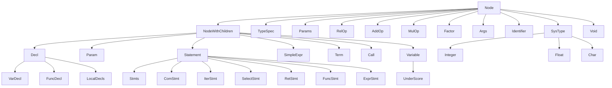

### AST类继承体系

`NodeWithChildren`就是带有不同类型孩子的`Node`

#### Nonterminal
| Class | Base class |
| --- | --- |
| Program | Node |
| Decl | NodeWithChildren |
| VarDecl | Decl |
| FuncDecl | Decl |
| TypeSpec | Node |
| Param | NodeWithChildren |
| Params | Node |
| Statement | NodeWithChildren |
| ComStmt | Statement |
| ExprStmt | Statement |
| FuncStmt | Statement |
| SelectStmt | Statement |
| IterStmt | Statement|
| RetStmt | Statement |
| Stmts | Statement |
| SimpleExpr | NodeWithChildren |
| LocalDecls | Decl |
| AddiExpr | NodeWithChildren |
| RelOp | Node |
| AddOp | Node |
| MulOp | Node |
| Term | NodeWithChildren |
| Factor | Node |
| Call | NodeWithChildren|
| Variable | NodeWithChildren |
| Args | Node |

#### Terminal
| Class | Base class |
| --- | --- |
| Identifier | Node |
| SysType | Node |
| Integer | SysType |
| Float | SysType |
| Char | SysType |
| UnderScore | Variable |
| Void | Node |

#### Graph

